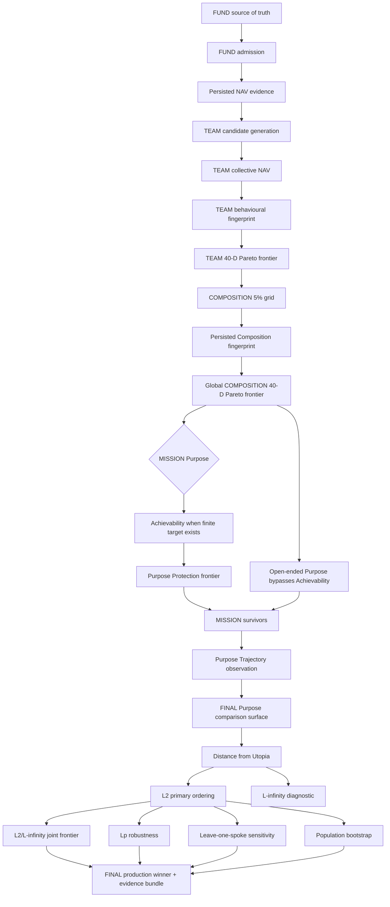
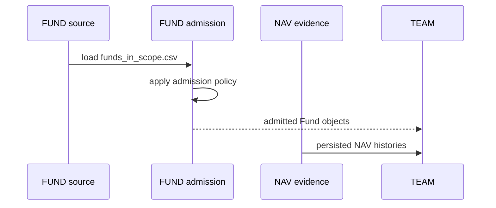
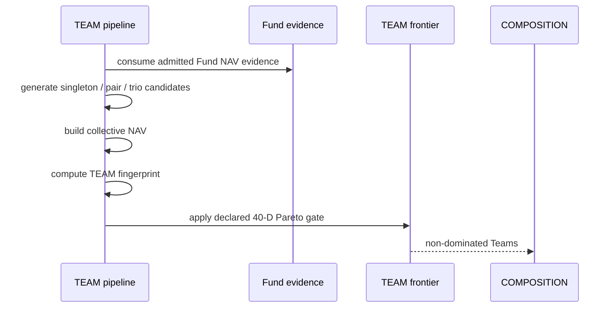
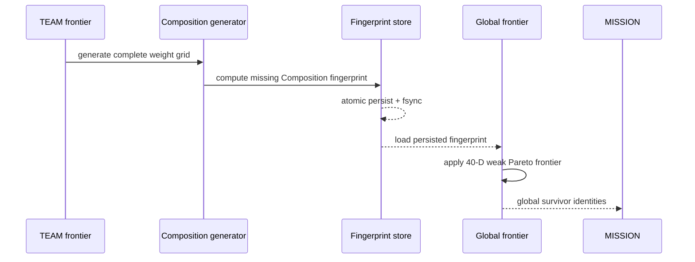
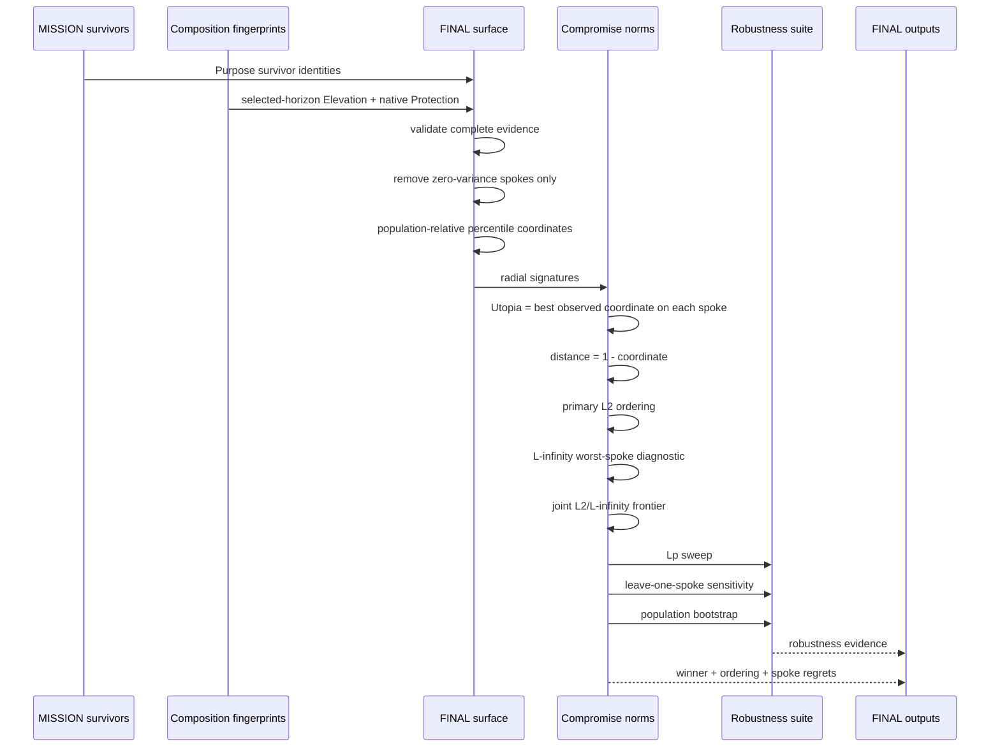

# Lakshya Production Pipeline Sequence

**Status:** Production sequence for FINAL / Compromise Programming v1

This document is the execution map for the production pipeline. It complements the detailed stage specification in `docs/Lakshya_Production_Architecture_v1.md`.

---

## 1. End-to-end sequence



---

## 2. Persistence boundary

The production persistence pattern is:

```text
FUND NAV evidence
      ↓
TEAM / COMPOSITION computation
      ↓
Composition fingerprint store
      ↓
Global frontier checkpoint
      ↓
MISSION checkpoints
      ↓
Trajectory checkpoints
      ↓
FINAL evidence bundle
```

The expensive Composition evidence is computed once and persisted immediately. FINAL never reconstructs Composition NAV from raw Funds merely because FINAL is a new consumer.

---

## 3. FUND sequence



### Production invariant

The admission distinction between CURRENT and POTENTIAL is consumed only at admission. It is not carried as a hidden optimization preference into TEAM, COMPOSITION, MISSION or FINAL.

---

## 4. TEAM sequence



TEAM must not call backward into MISSION to make itself smaller.

---

## 5. COMPOSITION sequence



### Production invariant

If a valid Composition fingerprint exists, a downstream algorithm change must reuse it. Recalculation requires a genuine upstream evidence or fingerprint-schema change.

---

## 6. MISSION sequence

```mermaid
sequenceDiagram
    participant Global as Global frontier
    participant Purpose as Purpose
    participant Mission as MISSION
    participant Trajectory as TRAJECTORY
    participant Final as FINAL

    Global->>Mission: persisted global survivor identities
    Purpose->>Mission: Purpose horizon + target inputs
    alt finite target Purpose
        Mission->>Mission: Achievability gate
    else open-ended Purpose
        Mission->>Mission: skip Achievability; retain Purpose evidence path
    end
    Mission->>Mission: Protection-only frontier
    Mission-->>Trajectory: Purpose survivors
    Purpose->>Trajectory: requested Purpose horizon
    Trajectory->>Trajectory: choose supported observation horizon
    Trajectory-->>Final: persisted trajectory evidence
```

### Horizon invariant

The supported analytical ladder is `3Y / 5Y / 7Y / 10Y`.

The selected analytical horizon is the longest supported horizon not beyond the Purpose horizon.

---

# 7. FINAL sequence

FINAL is downstream of MISSION. It does not change the MISSION survivor set.



---

## 8. FINAL mathematical sequence

For a Purpose with selected Elevation horizon `H`:

```text
7 Elevation(H) + 12 Protection
             ↓
remove zero-variance spokes
             ↓
population-relative percentile coordinates x_ij ∈ [0,1]
             ↓
Utopia U_j = 1
             ↓
regret d_ij = 1 - x_ij
             ↓
L2(i) = sqrt(sum_j d_ij²)
             ↓
primary ordering
```

Diagnostics:

```text
L∞(i) = max_j d_ij
        ↓
worst-spoke inspection
        ↓
joint (L2, L∞) non-dominated frontier
```

Robustness:

```text
L1 … L10 sweep
        +
leave-one-spoke L2 reruns
        +
5,000 population resamples
```

No stage in this sequence invents a Purpose score.

---

# 9. Current production 7Y shape

For the current five 245-Composition Purpose populations:

```text
19 candidate spokes
    ↓
1 constant spoke removed
    ↓
18 informative spokes
```

The removed spoke is:

```text
elevation_7y_positive_period_pct
```

It is removed because it has zero variance across the current comparison population, not because it is inconvenient to the winner.

For Retirement or a future population, the surface is constructed independently. No winner or spoke set is copied from another Purpose.

---

# 10. Failure and resume semantics

A production run follows:

```text
load → validate → reuse valid checkpoint
                 ↓
              compute
                 ↓
             persist atomically
                 ↓
              validate
                 ↓
              consume
```

A missing or invalid checkpoint is recomputed only when the stage owns the ability to reconstruct it.

A downstream FINAL failure must not invalidate the Composition fingerprint store.

A later FINAL version can therefore be rerun against the same MISSION evidence without rebuilding FUND, TEAM or COMPOSITION unless its contract explicitly changes an upstream dependency.

---

# 11. Audit trail

The compact hand-off is:

```text
final_<Purpose>_summary.csv
```

The full audit trail is:

```text
axes
signatures
 distances
results
Lp sweep
leave-one-spoke
bootstrap
joint L2/L∞ frontier
summary
```

The intent is **30,000 feet ↔ 3 feet**: the decision remains compact, while every material calculation remains inspectable.

---

# 12. Production release boundary

FINAL v1 is considered production-complete when:

- its mathematical contract is documented;
- implementation is deterministic apart from explicitly seeded bootstrap sampling;
- zero-variance handling is explicit;
- missing evidence fails loudly;
- tests cover the mathematical invariants;
- outputs are atomic;
- the stage is versioned;
- the pipeline records the FINAL stage and its contract version;
- no exploratory region/clustering machinery is required for the production decision.

Any future change to the decision rule is a new production version, not an undocumented experiment folded into the current release.
