# Lakshya Production Pipeline Sequence

**Status:** Production execution map

**Release:** FINAL / Compromise Programming v1

**As of:** 2026-09-07

This document describes **how the Lakshya review executes**. `docs/Lakshya_Architecture.md` describes what each stage means and owns. `docs/Lakshya_HowTo.md` describes how a reviewer operates the workflow. The documents are intentionally complementary.

---

## 1. End-to-end annual review

The annual review has a completed analytical chain, human-controlled post-FINAL review layers, a deliberate historical persistence boundary, and then a separate CURRENT → TARGET transition stage.

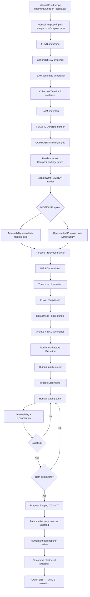

The analytical production direction is:

```text
FUND → TEAM → COMPOSITION → MISSION → FINAL
```

The complete annual-review direction is:

```text
FUND → TEAM → COMPOSITION → MISSION → FINAL
        ↓
FAMILY ARCHITECTURE VALIDATION
        ↓
PURPOSE STAGING
        ↓
HISTORICAL SNAPSHOT
        ↓
CURRENT → TARGET TRANSITION
```

The transition stage does not reopen the analytical decision and does not automatically execute transactions.

---

## 2. Human-controlled review boundary

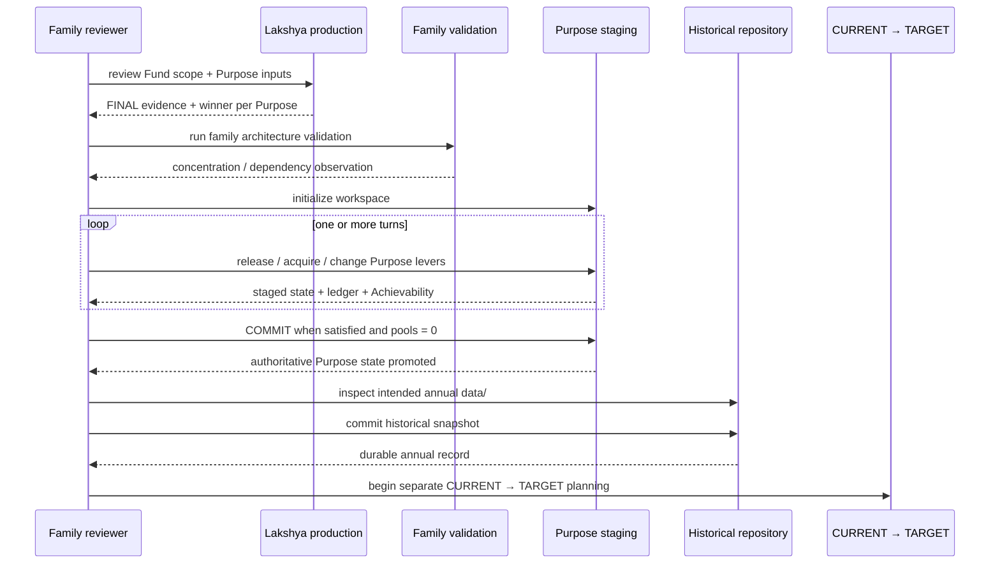

The governing principle is:

> **The reviewer controls the terrain; Lakshya calculates the consequences.**

---

# 3. Analytical production sequence

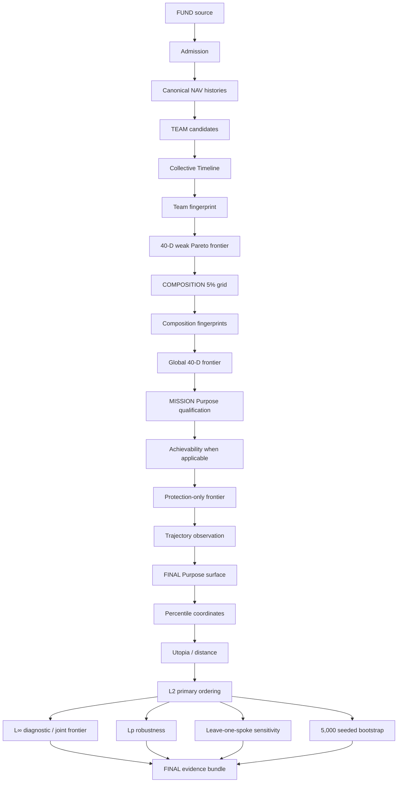

No stage may use a later stage merely to make its own universe smaller.

---

# 4. Persistence / resume sequence

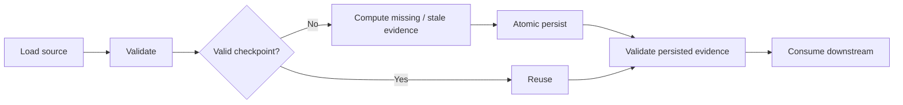

The critical invariant is:

> **A downstream failure must not invalidate upstream evidence that remains valid.**

Composition checkpoints use the durable, narrow Completion Index to avoid repeating expensive filesystem/JSON validation when the indexed checkpoint metadata still matches. The index is specifically a Composition checkpoint mechanism, not a generic artifact store.

---

# 5. FUND execution

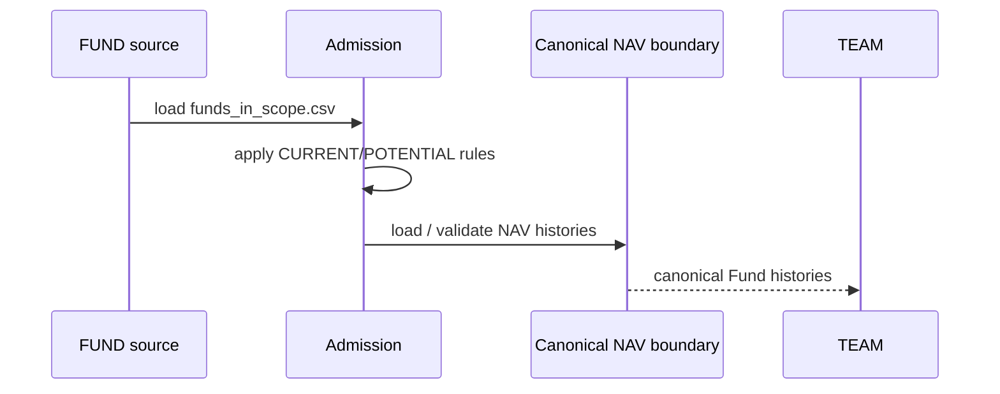

The 8-year lived-history rule applies to POTENTIAL/new-entry Funds. CURRENT Funds may be younger and remain valid. CURRENT/POTENTIAL do not become hidden downstream quality preferences.

---

# 6. TEAM execution

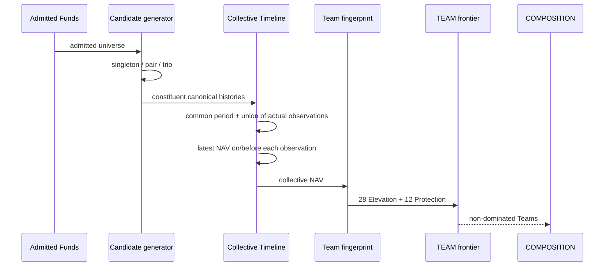

Collective Timeline semantics are exact: no calendar-day manufacture and no interpolation. A singleton Team reproduces its Fund trajectory.

---

# 7. COMPOSITION execution

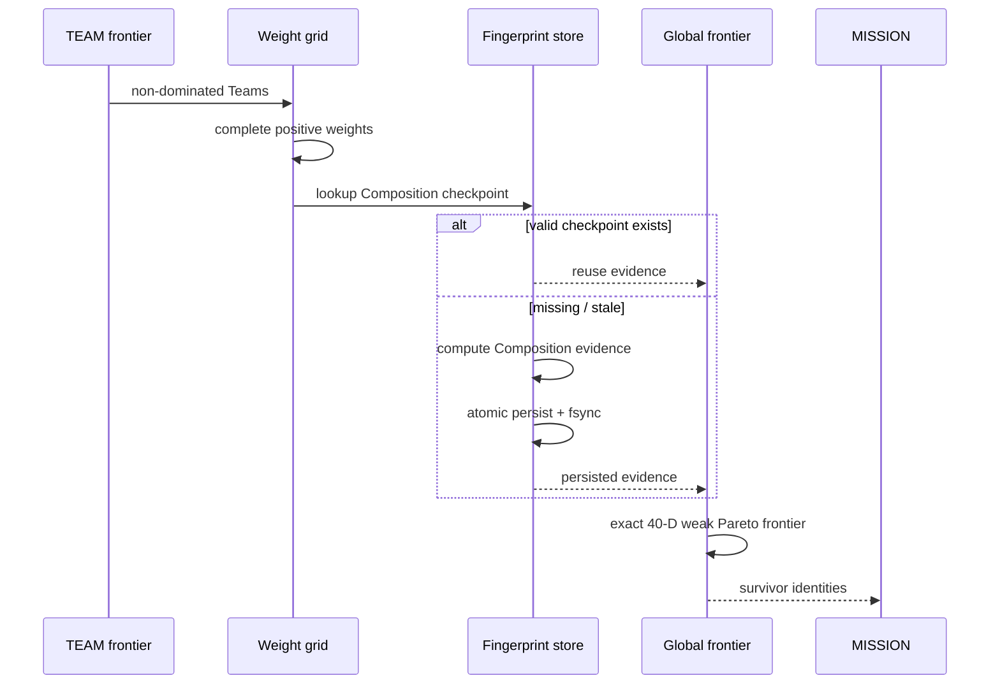

Current positive grid:

```text
singleton: 100%
pair:       19 allocations at 5% increments
trio:      171 allocations at 5% increments
```

A downstream algorithm change alone does not justify rebuilding valid Composition evidence.

---

# 8. MISSION execution

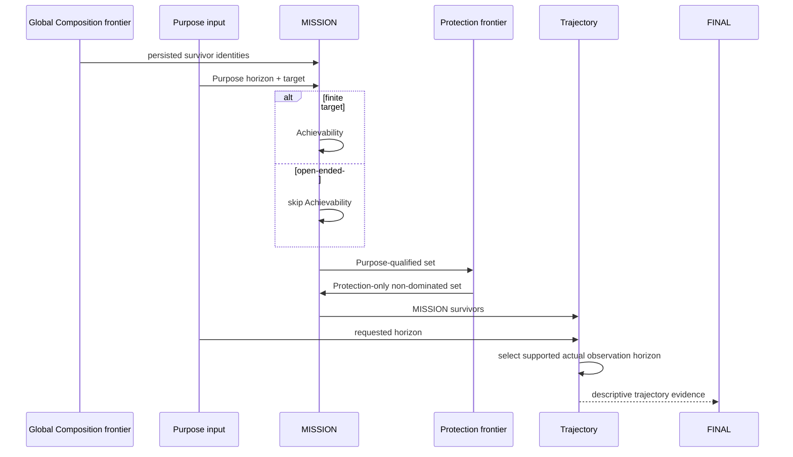

Supported analytical horizons are `3Y / 5Y / 7Y / 10Y`; the longest supported horizon not beyond the Purpose horizon is selected. Trajectory remains descriptive and does not currently eliminate a MISSION survivor.

---

# 9. FINAL execution

FINAL receives only MISSION survivors and does not reopen MISSION eligibility.


For selected horizon `H`, FINAL uses `7 Elevation(H) + 12 native Protection`. Retained spokes are equally weighted. L2 is the production ordering; robustness does not override the primary definition.

---

# 10. Family Architecture Validation execution

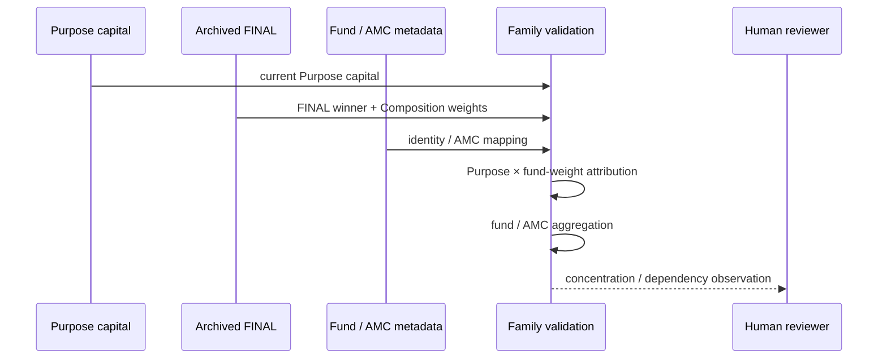

This layer is descriptive. It does not alter FINAL, optimize family allocation, impose concentration limits, or introduce transition assumptions.

---

# 11. Purpose Staging execution

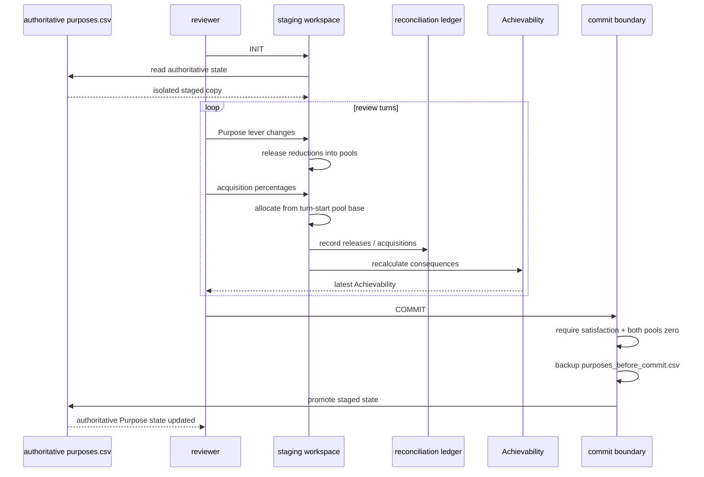

Purpose Staging never selects family priorities and never changes upstream analytical decisions.

---

# 12. Historical snapshot execution

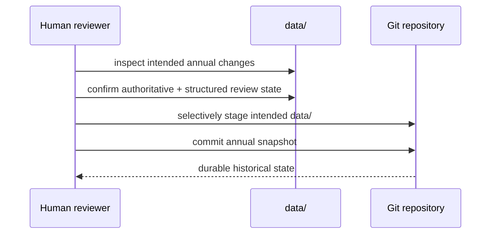

Historical Snapshot is a human-controlled persistence boundary. There is no separate automatic snapshotter. Generated runtime logs and `output/` remain disposable.

---

# 13. CURRENT → TARGET transition sequence

This stage starts **after** the annual snapshot has been deliberately committed. It is not part of the analytical optimizer.

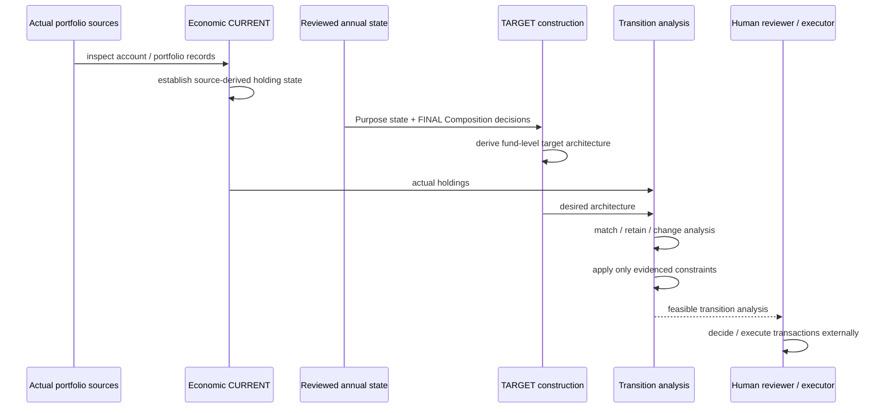

The critical distinction is:

```text
Analytical CURRENT = what the reviewed Lakshya architecture says
Economic CURRENT   = what the family actually owns
TARGET             = what the reviewed decisions imply should be owned
```

The first transition task is **source archaeology**, not coding. Inspect the actual portfolio/account material (including the identified Geojit material) to determine what it really provides for holding identity, units, current value, observation date, account/folio context, acquisition/transaction information, cost information, and missing facts.

Only then define the **minimum sufficient CURRENT contract**. Do not infer actual holdings from `funds_in_scope.csv`, FINAL summaries, or Purpose data.

---

# 14. Transition planning non-responsibilities

The CURRENT → TARGET stage does not:

- reopen FUND admission;
- redefine TEAM formation;
- alter Composition weights because of inconvenient current holdings;
- rerun MISSION merely because transition is difficult;
- replace a FINAL winner with a newly optimized fund;
- encode hidden Purpose priorities;
- equate analytical CURRENT with economic CURRENT;
- manufacture tax/cost/transaction facts absent from the source; or
- execute transactions automatically.

There is no production CURRENT schema, transition optimizer, tax engine, or transaction executor yet.

---

# 15. Production audit trail

For each Purpose, the durable/inspectable analytical path is:

```text
FUND evidence
→ TEAM evidence
→ COMPOSITION fingerprint
→ MISSION qualification
→ Trajectory observation
→ FINAL ordering + robustness
→ archived FINAL summary
→ family attribution
→ Purpose staging state
→ historical annual snapshot
```

The transition stage begins from that historical state plus separately sourced actual holdings. It must not pretend the analytical archive is an account statement.

---

# 16. What this document intentionally does not decide

This is an execution document. It does not introduce:

- Composition regions;
- clustering;
- subjective Purpose scoring;
- Purpose-specific spoke weights;
- synthetic Purpose targets;
- arbitrary L∞ thresholds;
- future-return forecasts; or
- causal explanations for why a Composition wins.

It also does not automate family priority selection, concentration tolerance decisions, redemption decisions, tax optimization, or reinvestment transactions.
