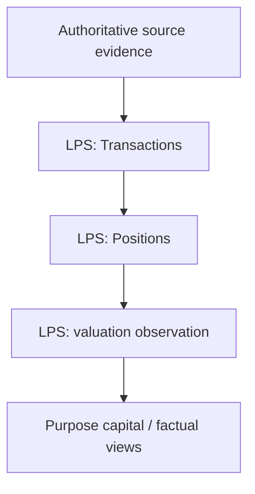
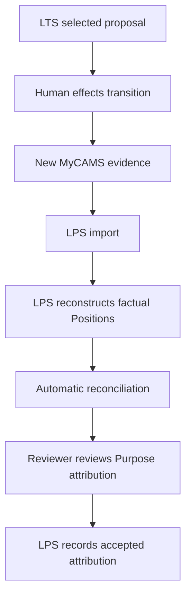

# Lakshya Production Pipeline Sequence

**Status:** Production execution map

**Release:** Domain Boundary Freeze v1

**As of:** 2026-09-08

This document describes **how the Lakshya review executes**. `docs/Lakshya_Architecture.md` defines the production architecture; `docs/Lakshya_Domain_Model.md` defines the bounded contexts and five cross-context contracts; `docs/Lakshya_HowTo.md` defines practical reviewer operation.

---

# 1. Three-system execution map

```text
                         HUMAN
                           │
                           ▼
                          LPS
                   source evidence
                           │
                ┌──────────┴──────────┐
                ▼                     ▼
               LFS                   LTS
        formation engine       transition engine
                │                     ▲
                └─────────────────────┘
```

The annual review does not form factual Positions by running the formation engine, and transition analysis does not replace formation selection.

The principal contracts are:

```text
LPS → LFS   Formation Evidence
LPS → LTS   Transition Evidence
LFS → LTS   Formation Intent
LTS → Human Transition Proposal
Human + new source evidence → LPS Reconciliation / Promotion
```

---

# 2. LPS execution — source to factual Positions



For mutual funds, CAS is the authoritative source boundary for transactions and holdings/history.

Family policy remains:

- request full-history CAS before the earliest family mutual-fund investment;
- include all folios, including zero-balance folios;
- retain original unmodified PDFs;
- enter passwords interactively and never store them;
- stop and ask the reviewer when source validation produces ambiguity;
- review validation before accepting the resulting factual state.

Validated source events become LPS Transactions. Transactions are factual records; there is no second Transaction concept.

Positions are reconstructed from Transactions.

```text
Position identity = Investor + Folio + ISIN
```

One accepted Position maps to exactly one Purpose. A Purpose may have zero, one, or many Positions.

NAV evidence is sparse and factual. Valuation uses the latest recorded NAV observation on or before the requested observation date.

---

# 3. Formation Evidence — LPS → LFS

LPS exposes a purpose-built formation projection:

```text
Formation Evidence
├── Funds represented by Positions
└── NAV observations / history
```

The reviewer may separately provide:

```text
potential_funds_in_scope
```

for funds not represented by existing Positions.

LFS then owns the entire analytical formation sequence:

```text
FUND
  ↓
Fund Fingerprint
  ↓
Fund-level weak-Pareto gate
  ↓
TEAM
  ↓
TEAM weak-Pareto frontier
  ↓
COMPOSITION
  ↓
Composition fingerprints
  ↓
Global Composition frontier
  ↓
MISSION
  ↓
FINAL
  ↓
TARGET
```

Fund Fingerprints never cross out of LFS.

---

# 4. LFS — formation execution

## FUND

Individual Fund behavioural evidence is constructed from LPS NAV history.

The Fund-level pruning gate between FUND and TEAM remains inside LFS.

## TEAM

TEAM forms deterministic singleton, pair, and trio candidates with maximum size 3.

The established comparator surface is:

```text
28 Elevation + 12 Protection = 40 dimensions
```

Weak Pareto non-dominance is used for elimination, not ranking.

## COMPOSITION

A Composition is:

```text
Team + complete weights
```

The canonical positive-weight grid is:

```text
singleton = 100%
pair       = 19 allocations at 5% increments
trio      = 171 allocations at 5% increments
```

Expensive Composition fingerprints are persisted immediately and reused downstream.

## MISSION

MISSION is the first stage where Purpose semantics enter.

Supported analytical horizons are:

```text
3Y / 5Y / 7Y / 10Y
```

For a finite Purpose due, derive the Purpose horizon and select the longest supported analytical horizon not exceeding it.

For an open Purpose horizon, the analytical horizon is locked to **7Y**.

History availability is evaluated per Composition. If a selected Composition lacks the requested lived history, the trajectory observation falls back to the next supported horizon without eliminating the MISSION survivor.

Trajectory remains descriptive.

## FINAL

FINAL selects the practical compromise among MISSION survivors using the established production rule and robustness evidence.

## TARGET

TARGET is the formation implied by reviewed Purpose decisions and selected FINAL Compositions. It is not another optimization stage.

---

# 5. Formation Intent — LFS → LTS

LFS supplies the selected Composition for **each Purpose**.

```text
Purpose A → Composition A
Purpose B → Composition A
Purpose C → Composition A
Purpose D → Composition A
Purpose E → Composition A
Purpose F → Composition B
```

The Purpose-level mapping is preserved even when multiple Purposes select the same Composition.

No Investor, Folio, Position ID, tax calculation, or transaction instruction crosses this contract.

---

# 6. Transition Evidence — LPS → LTS

LTS receives:

```text
Transition Evidence
├── Positions
├── relevant Transactions
├── Position → Purpose attribution
└── transition-relevant Fund metadata
```

Transactions themselves provide the historical acquisition/event evidence available to LTS. A separate acquisition-evidence object is not introduced without a demonstrated need.

LTS consumes only metadata genuinely required for transition mechanics.

---

# 7. Transition Proposal — LTS → Human

LTS compares factual Positions against Formation Intent and produces one or more candidate simulations.

```text
Transition Proposal
├── proposed Position transformation
└── proposed Purpose-attribution transformation
```

A proposed Position requiring a new folio is represented simply as:

```text
Investor: Appanna
ISIN: X
Folio: NEW
Purpose: Purpose C
```

`NEW` is a proposal marker. It is not a fabricated folio number and never becomes a factual Position identity.

The proposal is non-authoritative. It does not mutate LPS and does not execute transactions.

The human selects and effects a proposal externally.

---

# 8. Reconciliation / Promotion — new evidence → LPS

After execution, the reviewer imports the next authoritative MyCAMS transaction evidence.



The reconciliation workflow automatically identifies factual changes and candidate matches to the staged proposal, including newly observed Positions corresponding to proposal `NEW` markers.

The reviewer then gets the opportunity to accept or change the proposed Purpose attribution.

The governing rule is:

> **Automatic reconciliation. Human attribution acceptance.**

Position facts become authoritative through external evidence and LPS observation.

Purpose attribution becomes authoritative through explicit human acceptance.

Therefore:

> **LTS proposes. External evidence establishes Positions. The human establishes Purpose attribution. LPS records the resulting factual state.**

---

# 9. Historical Snapshot

Historical Snapshot is a human-controlled Git persistence boundary for reviewed annual state and analytical evidence.

It does not establish Position facts independently of LPS source evidence.

The durable record includes appropriate reviewed material under:

```text
data/fund/
data/purpose/
data/reviews/<as-of>/
```

Runtime output and forensic logs remain disposable where configured.

---

# 10. Human control boundaries

```text
Human
  │
  ├── defines / reviews Purpose
  ├── reviews formation scope and results
  ├── accepts or changes Purpose Attribution
  └── effects transactions externally

LPS
  └── establishes factual investment state from evidence

LFS
  └── forms investment architecture

LTS
  └── stages constrained transition proposals
```

The reviewer controls family decisions and execution. Lakshya calculates consequences, preserves evidence, and makes proposed transformations explicit.

---

# 11. Production invariants

1. **LPS observes. LFS forms. LTS transitions.**
2. Observed is not inferred.
3. Unknown is not zero.
4. One established Position maps to exactly one Purpose.
5. One Purpose may have zero, one, or many Positions.
6. A Purpose may exist before any Position is assigned to it.
7. Fund Fingerprints belong entirely inside LFS.
8. LTS never chooses TARGET formation.
9. LTS never mutates factual LPS Positions during simulation.
10. `NEW` is never a factual folio identity.
11. External source evidence establishes Position facts.
12. Human acceptance establishes Purpose attribution.
13. LTS proposals are non-authoritative.
14. Downstream convenience must not silently alter an upstream contract.
15. Domain concepts are not invented solely for implementation convenience.

The complete contract and domain definitions are maintained in `docs/Lakshya_Domain_Model.md`.
