# Lakshya Production Pipeline Sequence

**Status:** Production execution map

**Release:** FINAL / Compromise Programming v1

This document describes **how the Lakshya review executes from manual inputs through the analytical pipeline, family-level observation, Purpose Staging, and historical persistence**. The companion architecture document describes **what each stage means, owns, consumes, and guarantees**. The two documents are intentionally complementary rather than repetitive.

---

## 1. End-to-end Lakshya review sequence

The complete annual review has two distinct parts: the analytical production chain and the human-controlled post-FINAL review layers.

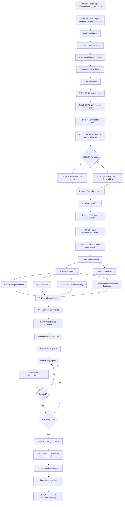

The analytical production direction is:

```text
FUND → TEAM → COMPOSITION → MISSION → FINAL
```

The complete review direction is:

```text
manual inputs
    ↓
FUND → TEAM → COMPOSITION → MISSION → FINAL
    ↓
FAMILY ARCHITECTURE VALIDATION
    ↓
PURPOSE STAGING
    ↓
HISTORICAL SNAPSHOT
    ↓
CURRENT → TARGET TRANSITION
```

The final transition is deliberately outside the analytical production decision. Lakshya does not automatically execute redemption or reinvestment.

---

## 2. Human-controlled review boundary

The annual review begins and ends with explicit human control. The system calculates consequences; it does not invent family priorities or transaction instructions.

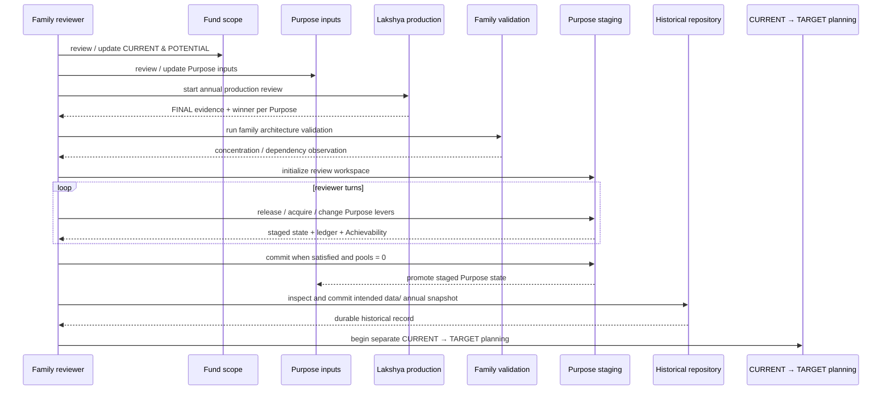

The key boundary is:

> **The reviewer controls the terrain; Lakshya calculates the consequences.**

---

# 3. End-to-end production sequence

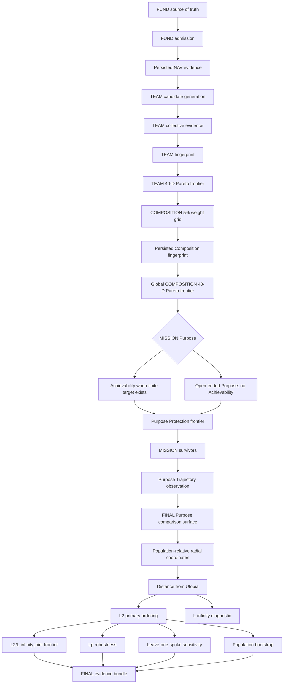

No stage is permitted to use a later stage merely to make its own universe smaller.

---

# 4. Stage ownership at a glance

| Stage | Produces | Consumed downstream |
|---|---|---|
| FUND | admitted Funds, NAV evidence, Fund behavioural evidence | TEAM |
| TEAM | Team candidates, collective evidence, Team fingerprint, TEAM frontier | COMPOSITION |
| COMPOSITION | complete weighted Compositions, persisted fingerprints, global frontier | MISSION |
| MISSION | Purpose-qualified survivors, trajectory evidence | FINAL |
| FINAL | ordering, robustness diagnostics, winner, audit bundle | Family Architecture Validation / human review |
| FAMILY ARCHITECTURE VALIDATION | family attribution, concentration and dependency observations | human review / Purpose Staging context |
| PURPOSE STAGING | staged Purpose state, reconciliation, Achievability | authoritative Purpose input after explicit commit |
| HISTORICAL SNAPSHOT | durable annual `data/` state | future annual review |

The production invariant is:

```text
compute → persist → validate → consume
```

---

# 5. FUND execution

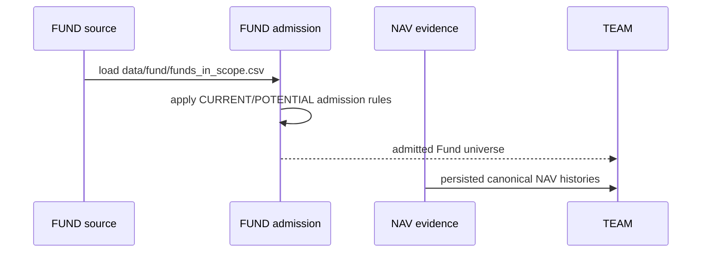

### Execution notes

The 8-year lived-history rule applies to POTENTIAL/new-entry Funds. CURRENT Funds may be younger and remain valid.

`CURRENT` and `POTENTIAL` are admission concepts, not hidden downstream preferences.

Regular versus Direct is not a Lakshya analytical distinction.

FUND evidence remains descriptive. FUND does not perform Purpose suitability or portfolio allocation.

---

# 6. TEAM execution

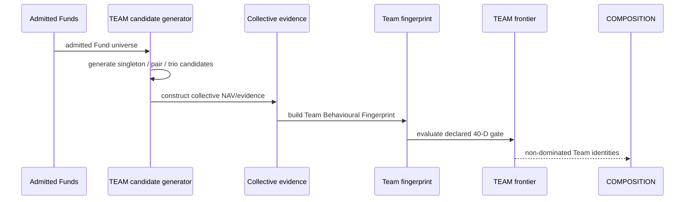

TEAM uses:

```text
28 Elevation + 12 Protection = 40 dimensions
```

with Elevation horizons `3Y / 5Y / 7Y / 10Y` and the seven declared rolling measures.

TEAM uses weak exact Pareto non-dominance. It does not import Purpose semantics merely to reduce the frontier.

Fund-level Resilience is not currently part of the TEAM comparator gate because TEAM has not earned that downstream need. The evidence remains a FUND-level concept.

---

# 7. COMPOSITION execution

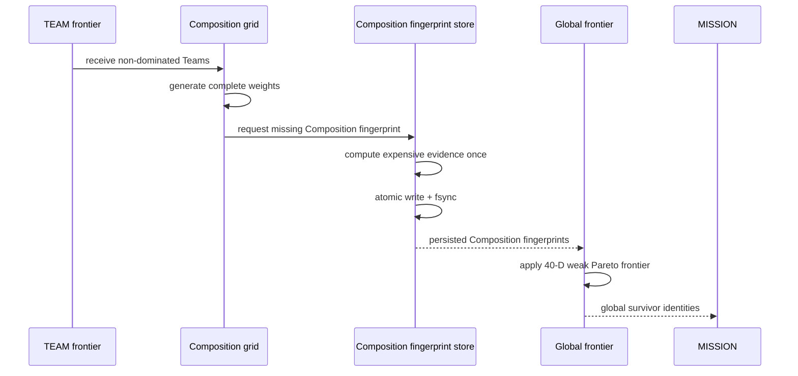

The positive weight grid is:

```text
singleton: 100%
pair:       19 allocations at 5% increments
trio:      171 allocations at 5% increments
```

The persistence rule is important:

> A downstream algorithm change does not justify rebuilding a valid upstream Composition fingerprint.

Recomputation requires a genuine upstream evidence or fingerprint-schema change.

---

# 8. MISSION execution

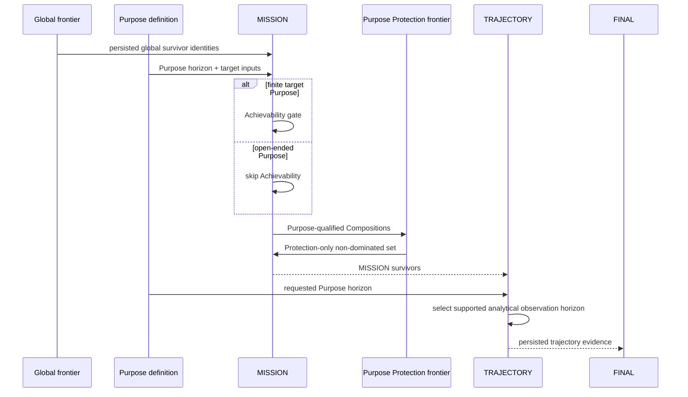

### Mission horizon execution rule

Supported analytical horizons are:

```text
3Y / 5Y / 7Y / 10Y
```

The canonical selection is the longest supported horizon not beyond the Purpose horizon.

Examples:

```text
4Y  → 3Y
6Y  → 5Y
8Y  → 7Y
9Y  → 7Y
12Y → 10Y
13Y → 10Y
```

Purpose horizon is never converted into a requirement for equivalent lived history.

### Trajectory execution rule

Trajectory observation uses the lower-level observation convention:

```text
latest observed NAV = end
requested target start = end - requested years
actual start = latest observation on/before target start
preserve every observed point from actual start to latest
normalize relative to actual start NAV
```

The output retains Purpose horizon, nominal analytical horizon, actual selected horizon and status.

Trajectory is descriptive in the current architecture and does not itself remove a MISSION survivor.

---

# 9. FINAL execution

FINAL receives **only MISSION survivors**. It does not reopen MISSION eligibility.

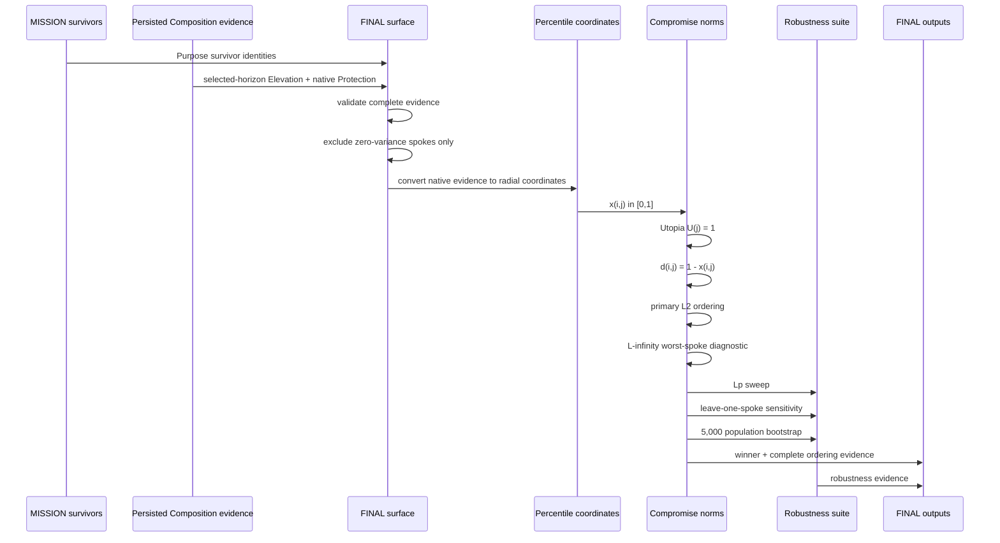

---

# 10. FINAL comparison surface

For Purpose-selected Elevation horizon `H`, FINAL begins with:

```text
7 Elevation(H) + 12 native Protection
```

All retained individual spokes have equal weight.

Protection is not given an artificial horizon.

A spoke is removed only when it has zero variance across the current comparison population.

For the current five 245-Composition Purpose populations:

```text
19 candidate spokes
− 1 zero-variance spoke
= 18 informative spokes
```

The current zero-variance spoke is:

```text
elevation_7y_positive_period_pct
```

The same construction is performed independently for each Purpose. No Purpose inherits another Purpose's winner or spoke set.

---

# 11. FINAL mathematical execution

For each retained spoke `j` and Composition `i`:

```text
native evidence
      ↓
population-relative percentile coordinate x(i,j)
      ↓
Protection direction reversed so higher = better
      ↓
Utopia U(j) = 1
      ↓
distance / regret d(i,j) = 1 - x(i,j)
```

Primary ordering:

$$
L_2(i)=\sqrt{\sum_j d_{ij}^{2}}
$$

Worst-spoke diagnostic:

$$
L_\infty(i)=\max_j d_{ij}
$$

Joint diagnostic:

```text
minimize (L2, L∞)
```

Robustness:

```text
p = 1.00 … 10.00 in steps of 0.25
+
leave one retained spoke out at a time
+
5,000 seeded population bootstrap resamples
```

No second normalization is applied to the percentile coordinates.

No subjective Purpose score is introduced.

---

# 12. Family Architecture Validation execution

Family Architecture Validation runs **after FINAL has been archived**. It observes the family-level consequence of independently derived Purpose decisions without changing those decisions.

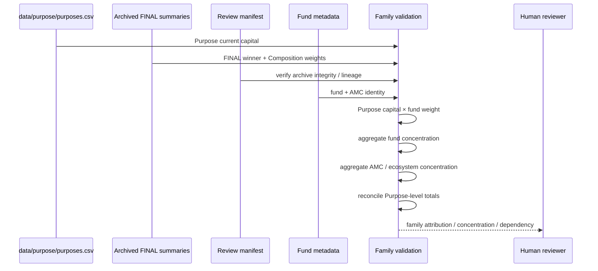

The layer consumes already-earned production information only. It does not recompute FINAL, inspect candidate populations, impose concentration thresholds, or alter winners.

Its central attribution contract is:

```text
Purpose current capital
        ×
FINAL Composition fund weight
        =
Attributed capital
```

The generated forensic log is not part of the canonical annual snapshot and is ignored by Git.

---

# 13. Purpose Staging execution

Purpose Staging begins only after the family-level observation has been reviewed. It is a human-in-the-loop reconciliation workspace, not an optimizer.

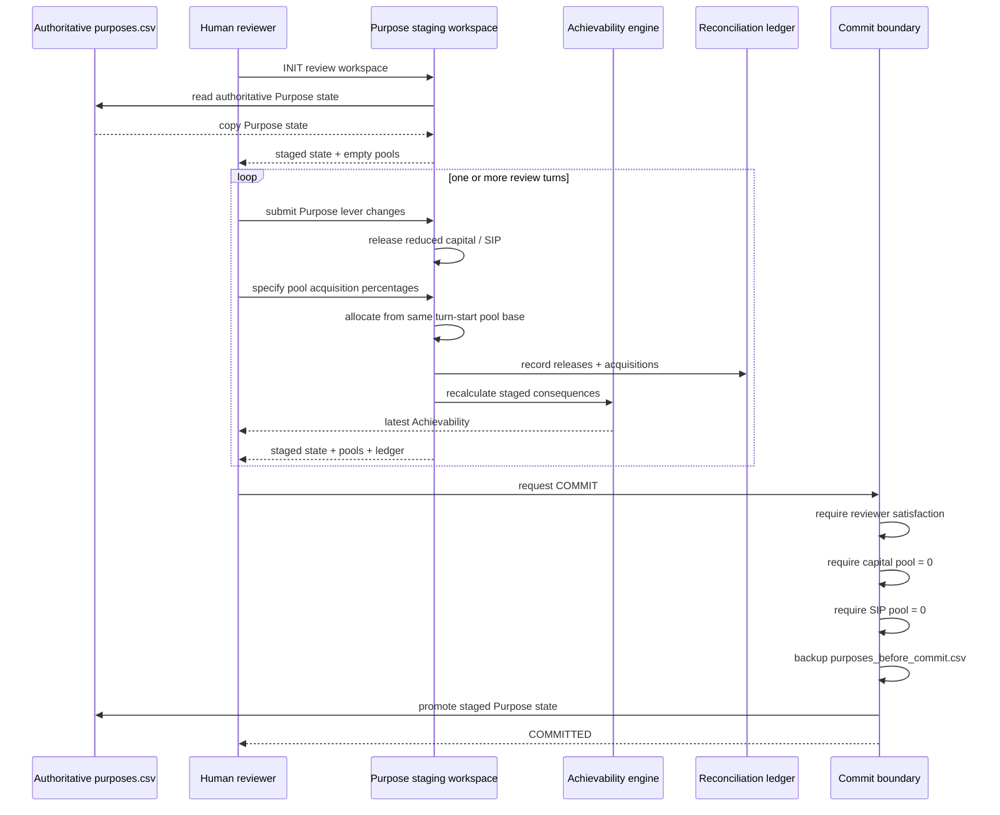

The conservation rule is:

```text
Purpose value reduction  → capital pool
Purpose SIP reduction    → SIP pool
pool acquisition         → another Purpose
```

A reviewer cannot silently create capital or SIP by directly increasing `value` or `monthly_plan`.

Acquisition percentages apply to the **same pool available at the start of the acquisition phase** for that turn; they are not applied sequentially to a shrinking pool.

The structured staging artifacts are retained under:

```text
data/reviews/YYYY-MM-DD/purpose_staging/
```

The generated `staging.log` remains beside them for forensic diagnosis but is ignored by Git.

---

# 14. Historical snapshot execution

After Purpose Staging is explicitly committed, the annual review reaches its persistence boundary. The durable `data/` state becomes part of Lakshya's historical memory.

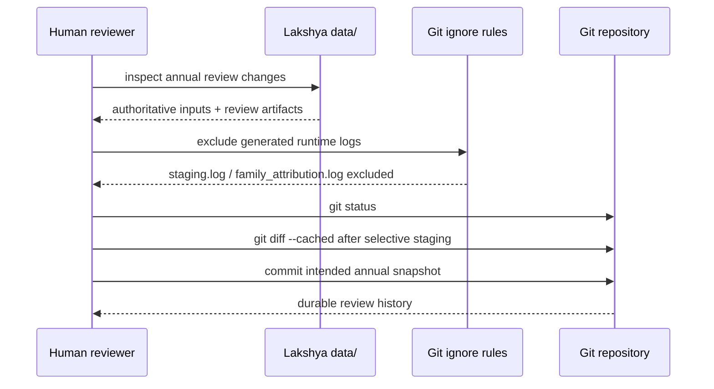

The intended persistence distinction is:

| Material | Persistence role |
|---|---|
| `data/fund/` authoritative inputs | durable, version-controlled |
| `data/purpose/` authoritative inputs | durable, version-controlled |
| `data/reviews/<as-of>/` structured annual artifacts | durable, version-controlled |
| `data/reviews/<as-of>/purpose_staging/` structured staging state | durable, version-controlled |
| `staging.log` | generated forensic log, Git-ignored |
| `family_attribution.log` | generated forensic log, Git-ignored |
| `output/` | disposable/regenerable runtime area |

The annual snapshot is a historical record, not a transaction ledger or automatic trading instruction.

---

# 15. Persistence and resume semantics

A production stage follows this pattern:

```text
load
  ↓
validate
  ↓
reuse valid checkpoint ──────────────┐
  ↓                                 │
compute missing/stale evidence      │
  ↓                                 │
atomic persist                      │
  ↓                                 │
validate                            │
  ↓                                 │
consume ◀───────────────────────────┘
```

The critical resume principle is:

> **A downstream failure must not invalidate upstream evidence that remains valid.**

Thus a future FINAL contract can be rerun against the same MISSION evidence without rebuilding FUND, TEAM or COMPOSITION unless the dependency contract genuinely changes.

---

# 16. Production audit trail

For each Purpose, FINAL produces:

```text
axes
signatures
distances
results
Lp sweep
leave-one-spoke sensitivity
bootstrap
joint L2/L∞ frontier
summary
```

The compact production hand-off is:

```text
final_<Purpose>_summary.csv
```

The remaining artifacts preserve the path from **30,000 feet to 3 feet** so that the winner is auditable rather than merely asserted.

Family Architecture Validation then produces the family-level attribution and dependency record, while Purpose Staging preserves the human reconciliation path.

---

# 17. What this document intentionally does not decide

This is an execution document. It does not define or introduce new analytical concepts beyond the production contract.

It therefore does not add:

- Composition regions;
- clustering;
- arbitrary k-neighbour connectivity;
- subjective Purpose scoring;
- Purpose-specific spoke weights;
- synthetic Purpose targets;
- arbitrary L-infinity thresholds;
- future-return forecasts; or
- causal explanations for why a Composition wins.

It also does not automate:

- family priority selection;
- concentration tolerance decisions;
- Purpose priority decisions;
- redemption decisions;
- tax or exit-load optimization; or
- reinvestment transactions.

Those belong to future explicitly versioned production contracts or human-controlled transition planning only if evidence earns them.

---

# 18. Production release boundary

FINAL v1 is production-complete when:

- the architecture is documented;
- the execution sequence is deterministic apart from explicitly seeded bootstrap sampling;
- incomplete required evidence fails loudly;
- zero-variance handling is explicit;
- expensive upstream evidence is reused;
- outputs are written atomically;
- the FINAL contract is versioned;
- tests cover the mathematical invariants; and
- exploratory machinery is not required for the production decision.

The broader annual review is complete for archival purposes when:

- manual Fund and Purpose inputs have been reviewed;
- production and Family Architecture Validation have been reviewed;
- Purpose Staging has been explicitly committed;
- intended `data/` changes have been inspected; and
- the annual snapshot has been committed to Git, excluding Git-ignored generated logs.

Any future change to the decision rule is a deliberate production version change, not an undocumented edit to the current pipeline.
