# Lakshya Production Pipeline Sequence

**Status:** Production execution map

**Release:** FINAL / Compromise Programming v1

**As of:** 2026-09-14

This document describes **how the Lakshya review executes**. `docs/Lakshya_Architecture.md` defines the wider production architecture; `docs/Lakshya_Domain_Model.md` defines the bounded contexts and five cross-context contracts; `docs/Lakshya_HowTo.md` defines practical reviewer operation.

---

# 1. Three-system execution map

Lakshya has three bounded systems with separate execution responsibilities:

```text
                         HUMAN
                           │
                           ▼
                          LPS
                   source evidence
                           │
                ┌──────────┴──────────┐
                ▼                     ▼
               LFS                   LTS
        formation engine       transition engine
                │                     ▲
                └─────────────────────┘
```

The annual review does **not** form factual Positions by running the formation engine, and transition analysis does not replace formation selection.

The principal contracts are:

```text
LPS → LFS   Formation Evidence
LPS → LTS   Transition Evidence
LFS → LTS   Formation Intent
LTS → Human Transition Proposal
Human + new source evidence → LPS Reconciliation / Promotion
```

This is not a forced serial `LPS → LFS → LTS` pipeline. LPS feeds both downstream consumers; LFS additionally feeds LTS.

---

# 2. End-to-end annual review

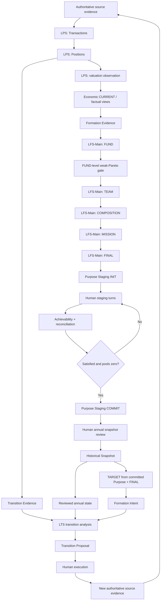

The durable annual review therefore has three distinct concerns:

```text
LPS → factual investment evidence → Economic CURRENT

LFS-Main → FUND → TEAM → COMPOSITION → MISSION → FINAL

Purpose Staging → reviewed Purpose state

Historical Snapshot → durable annual memory

TARGET → committed Purpose state + selected FINAL decisions

LTS → transition analysis using LPS facts + LFS intent
```

Purpose Staging is a human reconciliation boundary, not an additional optimizer. TARGET is derived after the reviewed Purpose state is committed; it is not produced by LFS-Main before staging.

---

# 3. Human-controlled boundaries

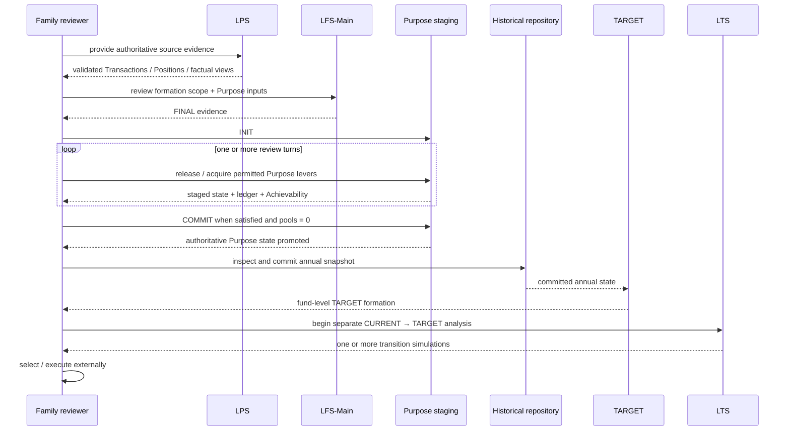

Governing principle:

> **The reviewer controls the terrain; Lakshya calculates the consequences.**

---

# 4. LPS execution — source to Positions

## 4.1 Source boundary

LPS starts with authoritative source evidence. For mutual funds, the family's authoritative account statement / CAS is the evidence boundary for transactions and holdings/history.

Family policy:

- request the statement comfortably before the earliest family mutual-fund investment;
- include all folios, including zero-balance folios;
- retain the original unmodified source PDFs;
- enter passwords interactively and never store them;
- treat warnings or ambiguity as stop-and-ask-human conditions;
- perform full-history import for each annual review; and
- review validation before accepting the resulting factual state.

The parser/library is an implementation boundary, not the LPS domain model. Parser-specific schemas must not leak into LFS or LTS.

## 4.2 Transactions

Validated source events become LPS `Transaction` records. A Transaction is factual at the LPS boundary; there is no second derived Transaction concept.

The family-wide transaction collection is:

```text
data/lps/transactions.csv
```

Each record retains investor identity. Re-importing one investor's full-history source replaces that investor's records while retaining other investors' records, making annual full-history import idempotent.

Shared event vocabulary includes:

```text
Purchase
Systematic Investment
Redemption
Switch In
Switch Out
Systematic Investment Rejection
STP-related
SWP-related
Stamp Duty
STT Paid
```

LPS records what actually appears in evidence. LTS may later reason about planned events; the vocabulary remains shared.

## 4.3 Positions

Positions are reconstructed from Transactions and stored family-wide:

```text
data/lps/positions.csv
```

Established Position identity is:

```text
Investor + Folio + ISIN
```

A Position is first-class and contains factual unit state. Valuation is applied as an observation rather than turning valuation into a separate state entity.

One accepted Position maps to exactly one Purpose. A Purpose may have zero, one, or many Positions.

## 4.4 Valuation

LPS applies an applicable NAV observation to the Position collection to derive valuation.

Two dates remain distinct:

```text
transaction_through_date
valuation_as_of_date
```

NAV evidence is sparse: only actual recorded observations are written. NAV reads are as-of reads:

```text
NAV as of X
= latest recorded NAV observation on or before X
```

No holiday observations are invented and no interpolation is performed.

LPS derives Purpose capital from Position valuation and accepted Position → Purpose attribution.

---

# 5. Formation Evidence — LPS → LFS

LPS exposes a purpose-built formation projection rather than a giant LPS object:

```text
Formation Evidence
├── funds
│   └── Fund identity required by formation
└── nav_histories
    └── ISIN → normalized NAV history
```

The formation fund universe has two sources:

```text
1. Funds represented by LPS Positions
2. Human-selected potential_funds_in_scope
```

The second source covers funds not represented by existing Positions. The reviewer is responsible for bringing only admissible candidates into `potential_funds_in_scope`; LFS does not contain a separate admissibility gate.

The legacy `data/lps/funds_in_scope.csv` mechanism is an implementation artifact to be replaced as this contract is implemented. NAV acquisition should ultimately derive ISINs from Positions plus reviewer-selected potential funds.

Formation Evidence contains no Position attribution, transaction history, transition information, or Fund Fingerprints.

---

# 6. LFS-Main analytical production sequence

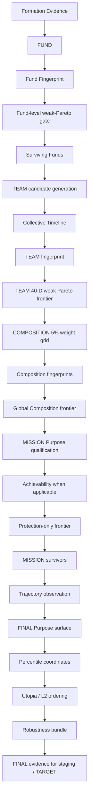

No stage may use a later stage merely to make its own universe smaller.

---

# 7. FUND execution

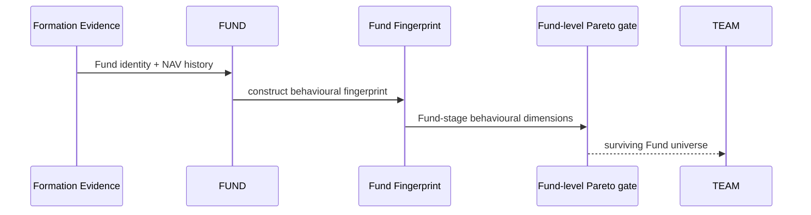

Fund Fingerprint is an LFS analytical intermediate. It never crosses a bounded-context contract.

The Fund-level weak-Pareto gate is a pruning boundary between FUND and TEAM. It is elimination, not ranking.

The 8-year lived-history rule applies to POTENTIAL/new-entry Funds. Existing family Funds may be younger and remain valid. These are admission concepts, not hidden downstream quality preferences.

Regular versus Direct is not a Lakshya analytical distinction.

Scheme Name and AMC remain useful factual identity/reference fields. Generic category/benchmark fields are not promoted unless a downstream contract genuinely consumes them.

---

# 8. TEAM execution

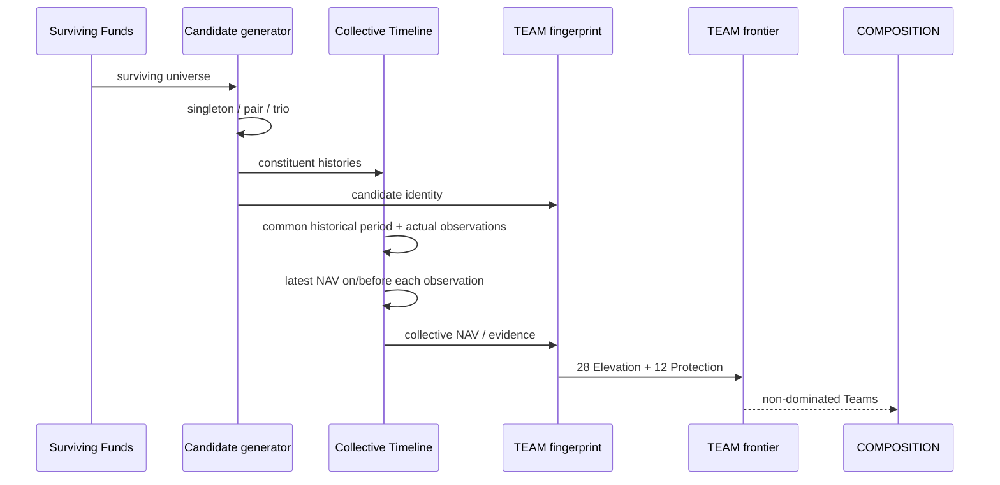

TEAM forms deterministic singleton, pair, and trio candidates, maximum size 3.

The declared comparator surface is:

```text
28 Elevation + 12 Protection = 40 dimensions
```

Weak Pareto non-dominance is:

```text
Elevation  → UP
Protection → DOWN
```

TEAM is elimination, not ranking.

Collective Timeline uses common actual observation dates and applicable recorded NAV observations. It does not manufacture calendar days or interpolate. A singleton reproduces its Fund trajectory.

---

# 9. COMPOSITION execution and checkpointing

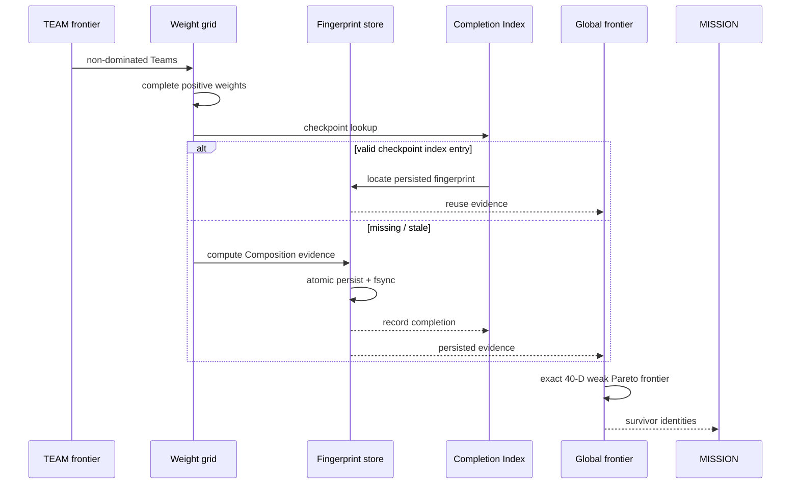

Canonical positive-weight grid:

```text
singleton: 100%
pair:       19 allocations at 5% increments
trio:      171 allocations at 5% increments
```

A Composition is **Team + complete weights**.

Composition fingerprints are durable reusable evidence containing identity, weights and behavioural evidence including NAV, Elevation and Protection.

The Completion Index is a **narrow Composition checkpoint mechanism**, not a generic artifact store.

A downstream algorithm change alone does not justify rebuilding valid Composition evidence.

The general persistence rule is:

```text
compute → persist → validate → consume
```

A downstream failure must not invalidate upstream evidence that remains valid.

---

# 10. MISSION execution

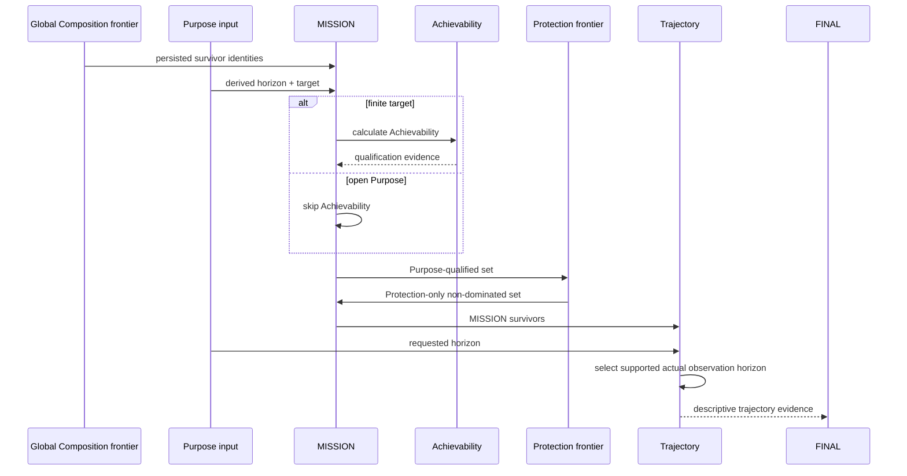

Supported analytical horizons are:

```text
3Y / 5Y / 7Y / 10Y
```

For a finite Purpose due, derive the Purpose horizon and select the longest supported analytical horizon not exceeding it. Examples:

```text
4Y → 3Y    6Y → 5Y    8Y → 7Y
9Y → 7Y   12Y → 10Y  13Y → 10Y
```

For an open Purpose, the analytical horizon is fixed at 7Y. It is not a separate Purpose input.

History availability is evaluated per Composition. Insufficient trajectory history produces an explicit insufficient-evidence result rather than silently eliminating a MISSION survivor. Trajectory is descriptive and does not eliminate a MISSION survivor.

---

# 11. FINAL execution

FINAL receives only MISSION survivors and does not reopen MISSION eligibility.

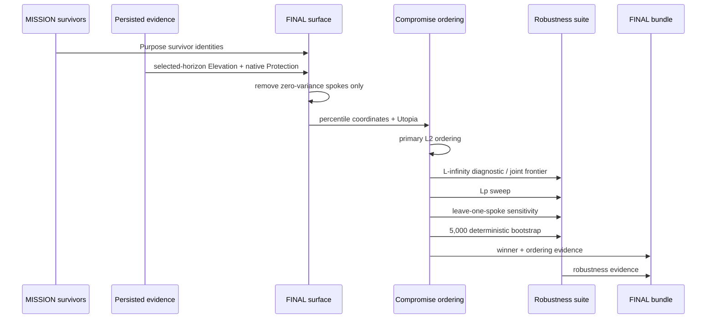

For selected horizon H:

```text
7 Elevation(H) + 12 native Protection
```

Zero-variance spokes are removed deterministically. Retained spokes are equally weighted and converted to population-relative desirability coordinates in `[0,1]`, with higher always better. The Utopia Point is the best observed value on each retained spoke.

```text
d(i,j) = 1 - x(i,j)
L2(i) = sqrt(sum(d(i,j)^2))
```

The smallest unweighted L2 distance is the production winner. L-infinity remains a worst-spoke diagnostic and participates in a joint `(L2, L∞)` frontier; there is no arbitrary L-infinity kill threshold.

FINAL also records:

- Lp winner sweep from 1.00 to 10.00 in 0.25 increments;
- leave-one-spoke sensitivity; and
- 5,000 deterministic population bootstrap resamples by default.

Robustness evidence describes stability; it does not override the primary winner.

---

# 12. Purpose Staging execution

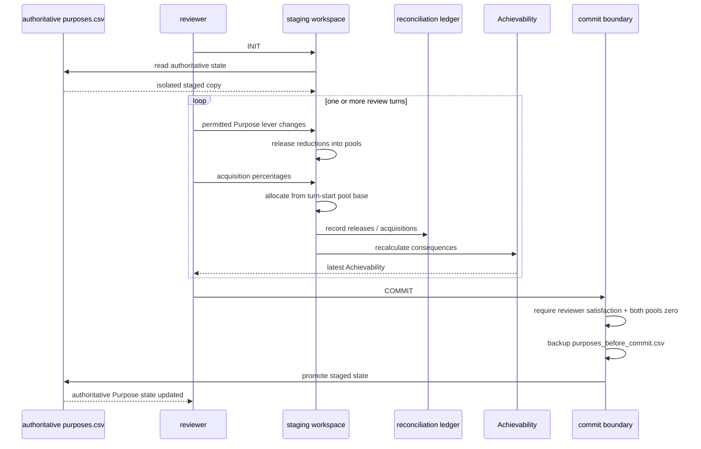

Purpose Staging is a separate execution stage from LFS-Main production. It does not alter FUND, TEAM, COMPOSITION, MISSION, FINAL, or selected FINAL Composition.

The permitted staging levers are:

```text
value
monthly_plan
capital_acquire_pct
sip_acquire_pct
```

`desired` and `due` remain fixed context. `analytical_horizon_years` is derived and is not a human Purpose field.

The accounting contract is:

```text
Purpose reduction → common pool
pool acquisition  → another Purpose
```

Acquisition percentages use the same pool base at the start of the acquisition phase for that turn; they are not applied sequentially to a shrinking pool.

The reviewer cannot silently create capital or SIP by increasing a capital value or monthly plan. Changes to desired or due are upstream Purpose-input changes, not staging levers.

The authoritative `data/purpose/purposes.csv` remains unchanged until explicit COMMIT. COMMIT requires reviewer satisfaction and both pools equal to zero; the authoritative file is backed up before promotion.

---

# 13. Historical Snapshot execution

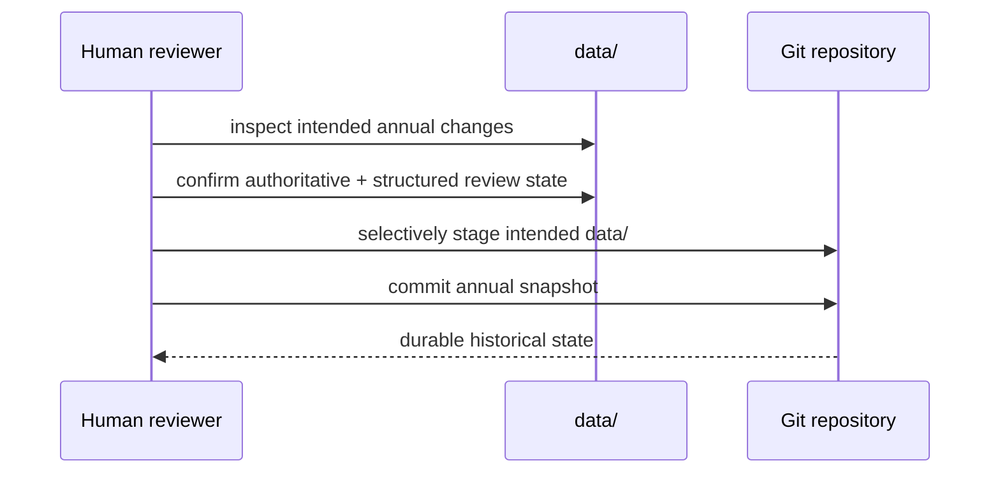

Historical Snapshot is a human-controlled Git persistence boundary. There is no separate automatic snapshotter.

The durable record includes appropriate reviewed material under:

```text
data/lps/
data/purpose/
data/lfs/
```

Runtime output and forensic logs remain disposable where configured.

Historical Snapshot is memory. It is not a transaction ledger and does not establish Position facts independently of LPS source evidence.

---

# 14. CURRENT → TARGET execution

The authoritative annual sequence is:

```text
FINAL
  ↓
Purpose Staging
  ↓
Historical Snapshot
  ↓
CURRENT
  ↓
TARGET
```

CURRENT and TARGET are deliberately different states:

```text
ANALYTICAL CURRENT
= what the reviewed Lakshya architecture says

ECONOMIC CURRENT
= what the family actually owns at the chosen observation date

TARGET
= what the committed Purpose state + selected FINAL decisions imply should be owned
```

Economic CURRENT is source-derived by LPS. TARGET is derived from the committed Purpose state and selected FINAL Composition decisions. Neither is inferred from the other.

TARGET is not another optimization stage:

```text
committed Purpose state
        ↓
selected FINAL Composition per Purpose
        ↓
Composition fund weights
        ↓
fund-level TARGET architecture
```

Formation Intent then preserves the Purpose-level mapping for LTS:

```text
Purpose → Composition
```

---

# 15. Transition Evidence — LPS → LTS

LTS receives a purpose-built Transition Evidence projection:

```text
Transition Evidence
├── Positions
│   ├── Investor
│   ├── Folio
│   ├── ISIN
│   ├── Units
│   └── valuation observation
│       ├── NAV
│       ├── observation date
│       └── Market Value
├── Transactions
│   └── relevant historical transaction evidence
├── Position → Purpose attribution
└── transition-relevant Fund metadata
```

Transactions themselves are the available historical acquisition/event evidence. LTS may derive acquisition lots, holding periods, and FIFO consequences from them; no second acquisition-evidence object is introduced without demonstrated need.

LTS consumes Fund metadata only insofar as it affects transition mechanics. It does not consume behavioural Fund Fingerprints, TEAM, COMPOSITION, MISSION, or FINAL as analytical objects.

---

# 16. LTS transition sequence

This sequence begins after the reviewed annual persistence boundary. It is not part of the LFS analytical optimizer.

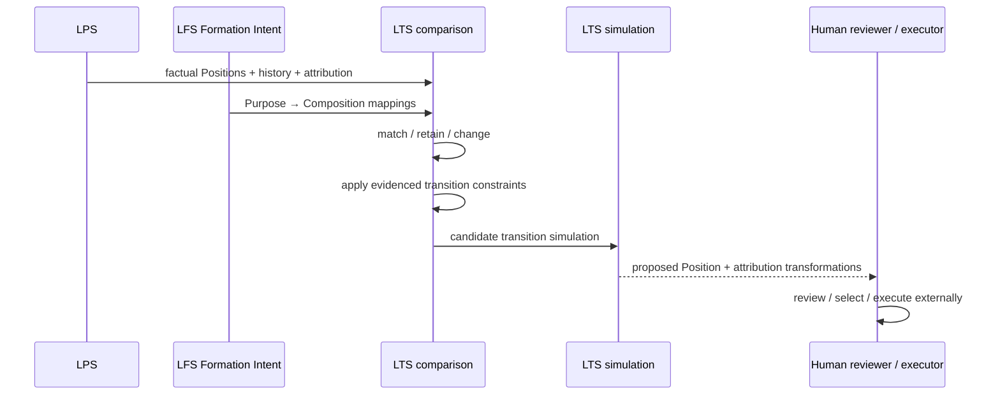

The native LTS reasoning is:

```text
factual Positions
      +
Formation Intent
      ↓
what matches?
what can remain?
what differs?
what must change?
what constraints apply?
what sequence is feasible?
      ↓
Transition Proposal
```

The target granularity is the established Position identity:

```text
Investor + Folio + ISIN
```

Investor matters because different investors can have different tax consequences. Folio matters because the same ISIN may appear in different folios and Purpose relationships.

A proposed Position that requires a new folio may use a simulation-local placeholder:

```text
Investor + NEW-FOLIO-001 + ISIN
```

The placeholder is not a fabricated real-world folio. A proposal-local Position ID may distinguish multiple intended allocations before actual folio creation.

LTS does not introduce a generic `Action` abstraction merely because transition logic contains verbs. The concept must earn its existence.

---

# 17. Transition constraints and source archaeology

The first LTS implementation task is **source archaeology, not schema design**.

The actual portfolio/account source material must establish what is genuinely available for:

- holding identity;
- units and value;
- observation date;
- account/folio representation;
- acquisition/transaction information;
- cost information and granularity;
- source-authoritative versus presentation fields; and
- facts the source does not provide.

Missing facts remain missing. Lakshya must not manufacture cost basis, acquisition dates, tax lots, exit costs, account semantics, or transaction constraints.

Where genuinely evidenced, LTS may eventually reason about:

- ELSS lock-in;
- acquisition-date tax consequences;
- STCG/LTCG implications;
- exit loads;
- transaction costs;
- liquidity;
- minimum transaction constraints;
- SIP/STP/SWP sequencing; and
- retain/exit/stage/switch/redeem/invest alternatives.

The source must earn each constraint.

---

# 18. Transition Proposal and reconciliation / promotion

LTS produces:

> **a proposed transformation of Positions and Purpose-attributions.**

The proposal is non-authoritative. Multiple simulations may coexist. No simulation mutates factual LPS state.

After a selected proposal is effected by the human:

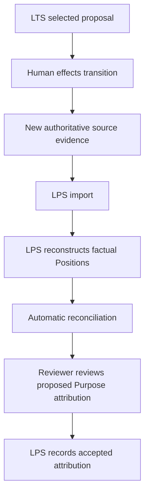

The reconciliation workflow:

1. detects factual changes and candidate matches to the staged proposal;
2. identifies newly observed Positions, including real folios corresponding to proposal-local NEW markers;
3. presents proposed Purpose attribution to the reviewer; and
4. records accepted attribution in LPS.

The governing rule is:

> **LTS proposes. External evidence establishes Positions. Human acceptance establishes Purpose attribution. LPS records the resulting factual state.**

This is intentionally asymmetric:

```text
Position proposal
    ↓
human execution
    ↓
external evidence
    ↓
LPS establishes resulting Position
```

and:

```text
Purpose-attribution proposal
    ↓
human acceptance
    ↓
promotion
    ↓
LPS accepted Purpose attribution
```

Promotion does not manufacture a Position. It reconciles a proposal against subsequently observed evidence.

---

# 19. Persistence and resume semantics

The general persisted-evidence lifecycle is:

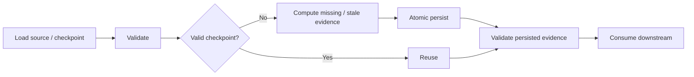

The invariant is:

> **A downstream failure must not invalidate upstream evidence that remains valid.**

Composition uses its narrow Completion Index to avoid unnecessary filesystem/JSON validation when indexed checkpoint metadata remains valid. This does not turn the index into a generic artifact store.

---

# 20. Human control and failure boundaries

```text
Human
  │
  ├── provides / reviews source evidence
  ├── defines / reviews Purpose
  ├── reviews formation scope and results
  ├── accepts Purpose attribution
  └── effects transactions externally

LPS
  └── establishes factual investment state from evidence

LFS
  └── forms investment architecture

LTS
  └── stages constrained transition proposals
```

Fail-closed boundaries apply where factual or analytical integrity is required. Ambiguous source evidence stops the factual pipeline for human review rather than silently guessing.

Formation and transition are not allowed to compensate for missing facts by inventing them.

---

# 21. Pipeline invariants

1. **LPS observes. LFS forms. LTS transitions.**
2. Observed is not inferred.
3. Unknown is not zero.
4. One established Position maps to exactly one Purpose.
5. One Purpose may have zero, one, or many Positions.
6. A Purpose may exist before any Position is assigned to it.
7. Fund Fingerprints belong entirely inside LFS.
8. The Fund-level weak-Pareto gate belongs between FUND and TEAM inside LFS.
9. TARGET is derived only from committed Purpose state + selected FINAL decisions.
10. LTS never chooses TARGET formation.
11. LTS never mutates factual LPS Positions during simulation.
12. A proposal-local NEW folio marker is never a factual folio identity.
13. External source evidence establishes Position facts.
14. Human acceptance establishes Purpose attribution.
15. LTS proposals are non-authoritative.
16. A downstream convenience must not silently alter an upstream contract.
17. A calculation does not automatically become a downstream input.
18. Persisted evidence is reused rather than silently recomputed.
19. Domain concepts are not invented solely for implementation convenience.

The complete domain and contract definitions are maintained in `docs/Lakshya_Domain_Model.md`.

---

# Appendix — Current Implementation Status and Transition Boundary

**Status date:** 2026-09-23  
**Purpose of this appendix:** Enrich the established architecture with the current implementation evidence without replacing or weakening any previously documented contract.

The established architecture remains authoritative. This appendix records the current state of the implementation and the remaining engineering work; it does not redefine the domain model, introduce a second optimizer, or convert diagnostic output into execution authority.

## Current boundary

Lakshya continues to separate three responsibilities:

```text
LPS — factual Economic CURRENT
LFS — reviewed formation intent and TARGET inputs
LTS — constrained CURRENT → TARGET analysis
```

The transition foundation currently works from source-derived transaction and position evidence, explicit Purpose attribution, and reviewed formation intent. The human review and external-execution boundary remains intact.

## Implemented transition foundation

The current implementation includes:

- a source-derived Position and acquisition-lot bridge;
- availability and lock-in classification;
- explicit Position → Purpose transition mapping;
- reconciliation reporting at lot, Position, Purpose, and transition levels;
- explicit locked-holding representation;
- selected-fund evidence; and
- a slice-materialization foundation intended to produce reviewable artifacts.

## Validated evidence

The current validation evidence includes:

- **696 lots** and **34 Position summaries**;
- **602 available** lots and **94 locked** lots;
- no negative lot balances in the validated result;
- six balanced Purpose reports; and
- numerical reconciliation within floating-point tolerance.

These are implementation-validation observations, not a claim that the transition workflow is execution-ready.

## Design invariants retained

The implementation must continue to preserve the following:

1. Position identity is `Investor + Folio + ISIN`.
2. Ownership and Purpose attribution remain explicit.
3. `transaction_through_date` and `valuation_as_of_date` remain separate.
4. Source facts and analytical interpretation remain distinguishable.
5. Locked holdings are explicit and are not silently treated as available.
6. Unknown facts remain unknown.
7. Materialization is a review artifact, not execution permission.
8. LTS is constrained transition analysis, not a second portfolio optimizer.
9. Source anomalies are classified rather than silently deduplicated or discarded.

## Known gaps

The current implementation still has open issues:

1. Materialization is not yet fully integrated into the runner and final artifact contract.
2. Selected-fund retention behavior requires a data-driven correction; it must not be repaired with hard-coded exceptions.
3. A valuation discrepancy remains approximately **₹27,420.24**.
4. Exact duplicate transaction rows remain present and must be classified explicitly rather than silently deduplicated.
5. End-to-end artifact production and repeatable clean-run validation still require completion.

## Required engineering sequence

```text
classify source anomalies
        ↓
correct retention semantics
        ↓
integrate materialization into the runner
        ↓
finalize the artifact contract
        ↓
reconcile end to end
        ↓
repeat validation from a clean run
        ↓
present evidence for human review
```

Until these gates are completed, generated outputs should be treated as engineering evidence and diagnostics—not transaction instructions.


## Current transition-stage sequence

The current implementation adds the following evidence-producing sequence beneath the existing pipeline:

```text
source Transactions
        ↓
lot reconstruction
        ↓
availability / lock classification
        ↓
Position bridge
        ↓
Purpose mapping
        ↓
lot → Position → Purpose reconciliation
        ↓
slice materialization
        ↓
human review artifact
```

This sequence is subordinate to the established pipeline and does not bypass the existing LPS, LFS, Purpose Staging, Historical Snapshot, or human review boundaries.

A balanced aggregate must not be treated as sufficient by itself. The underlying source rows, lot lineage, Position identity, Purpose attribution, and open anomalies must remain inspectable.
