# Lakshya Production Pipeline Sequence

**Status:** Production execution map

**Release:** FINAL / Compromise Programming v1

**As of:** 2026-09-08

This document describes **how the Lakshya review executes**. `docs/Lakshya_Architecture.md` defines what each system and stage owns. `docs/Lakshya_HowTo.md` defines how the reviewer operates the workflow.

---

# 1. Three-system execution map

Lakshya has three bounded systems with separate execution responsibilities:

```text
LPS
source evidence
    ↓
Transactions
    ↓
Positions
    ↓
valuation observation
    ↓
Economic CURRENT

LFS
human Fund/Purpose inputs
    ↓
FUND → TEAM → COMPOSITION → MISSION → FINAL
    ↓
TARGET

LTS
CURRENT + TARGET
    ↓
constrained comparison
    ↓
feasible transition analysis
    ↓
human plan / execution
```

The annual review therefore does **not** form CURRENT by running the LFS analytical chain. LPS and LFS produce the two sides of the later LTS hand-off independently.

---

# 2. End-to-end annual review

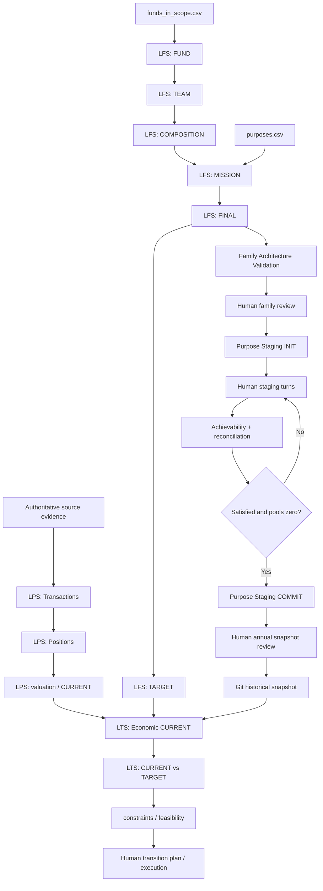

The conceptual direction is:

```text
LPS → CURRENT

LFS → FUND → TEAM → COMPOSITION → MISSION → FINAL → TARGET

LTS → CURRENT ↔ TARGET
```

Family Architecture Validation and Purpose Staging sit between FINAL and the deliberate historical snapshot; they are not additional optimization stages.

---

# 3. Human-controlled boundaries

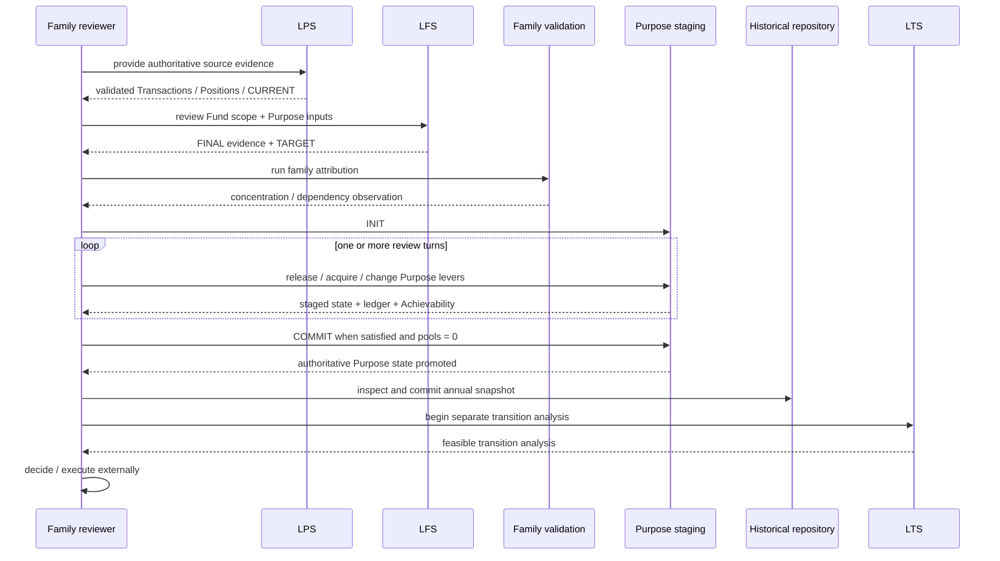

Governing principle:

> **The reviewer controls the terrain; Lakshya calculates the consequences.**

---

# 4. LPS execution — source to CURRENT

## 4.1 Source boundary

LPS starts with authoritative source evidence. For mutual funds, the CAS is the authoritative evidence boundary for transactions and holdings/history.

The family policy is:

- request the CAS comfortably before the earliest family mutual-fund investment;
- include all folios, including zero-balance folios;
- retain the original unmodified PDFs;
- enter the password interactively and never store it;
- treat warnings/ambiguity as stop-and-ask-human conditions;
- perform full-history CAS import for each annual review; and
- review validation before accepting CURRENT.

The parser/library is an implementation boundary, not the LPS domain model. Parser-specific schemas must not leak into LFS or LTS.

## 4.2 Transactions

Validated source events become LPS `Transaction` records. A Transaction is factual at the LPS boundary; there is no separate derived `CanonicalTransaction` domain concept.

The family-wide transaction collection is:

```text
data/lps/transactions.csv
```

Each record retains investor identity. Re-importing one investor's full-history CAS replaces that investor's records while retaining other investors' records, making annual full-history import idempotent.

Shared event vocabulary includes:

```text
Purchase
Systematic Investment
Redemption
Switch In
Switch Out
Systematic Investment Rejection
STP-related
SWP-related
Stamp Duty
STT Paid
```

LPS records what actually appears in evidence. LTS may later reason about events that are planned but not yet observed; the vocabulary remains shared.

## 4.3 Positions

Positions are reconstructed from Transactions and stored family-wide:

```text
data/lps/positions.csv
```

Position identity is:

```text
Investor + Folio + ISIN
```

A Position is first-class. It contains the factual unit state and may carry valuation fields when a valuation observation has been applied. There is no separate `CurrentState` domain object.

## 4.4 Valuation and CURRENT

LPS applies an applicable NAV observation to the Position collection to derive a valuation snapshot.

Two dates remain distinct:

```text
transaction_through_date
valuation_as_of_date
```

NAV evidence is sparse: only actual recorded observations are written. NAV reads are as-of reads:

```text
NAV as of X
= latest recorded NAV observation on or before X
```

No holiday observations are invented and no interpolation is performed.

CURRENT is the **consumer-facing valuation view/snapshot** of the Position collection. It is not another domain object.

---

# 5. LFS analytical production sequence

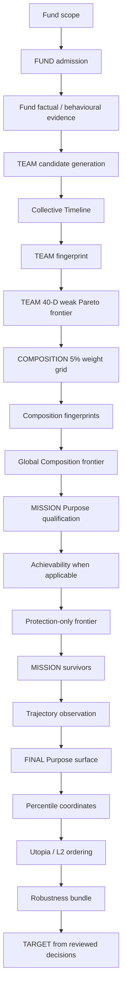

No stage may use a later stage merely to make its own universe smaller.

---

# 6. FUND execution

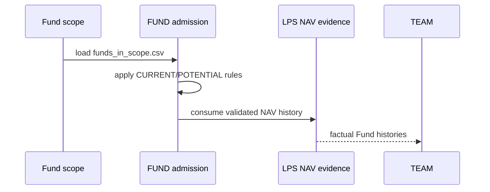

The 8-year lived-history rule applies to POTENTIAL/new-entry Funds. CURRENT Funds may be younger and remain valid. CURRENT/POTENTIAL are admission concepts, not hidden downstream quality preferences.

Scheme Name and AMC remain factual identity/reference fields. Generic category/benchmark fields are not promoted unless a downstream contract genuinely consumes them.

---

# 7. TEAM execution

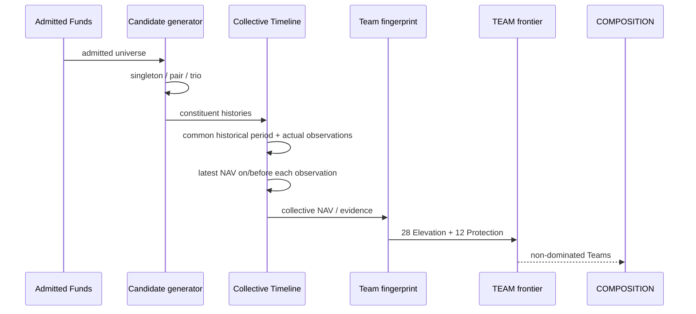

Collective Timeline does not manufacture calendar days or interpolate. A singleton reproduces its Fund trajectory.

---

# 8. COMPOSITION execution and checkpointing

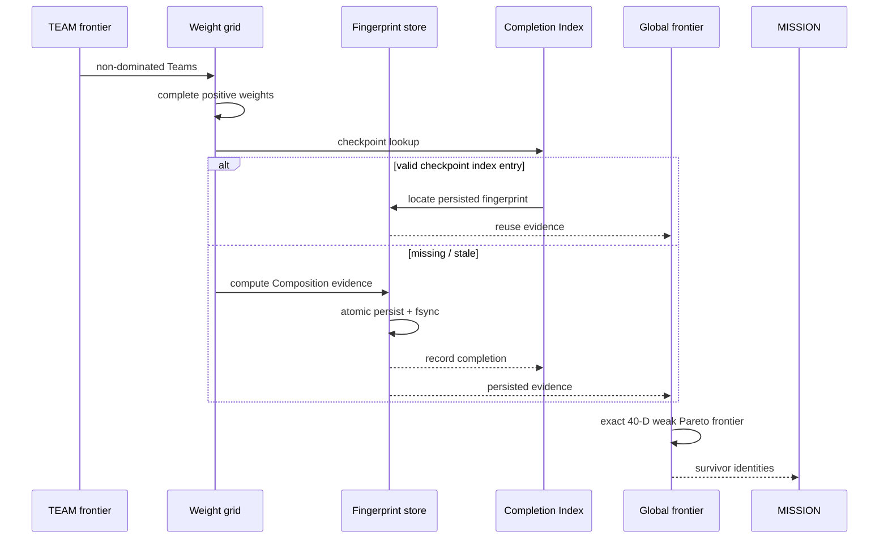

Current positive grid:

```text
singleton: 100%
pair:       19 allocations at 5% increments
trio:      171 allocations at 5% increments
```

The Completion Index is a **narrow Composition checkpoint mechanism**, not a generic artifact store.

A downstream algorithm change alone does not justify rebuilding valid Composition evidence.

---

# 9. MISSION execution

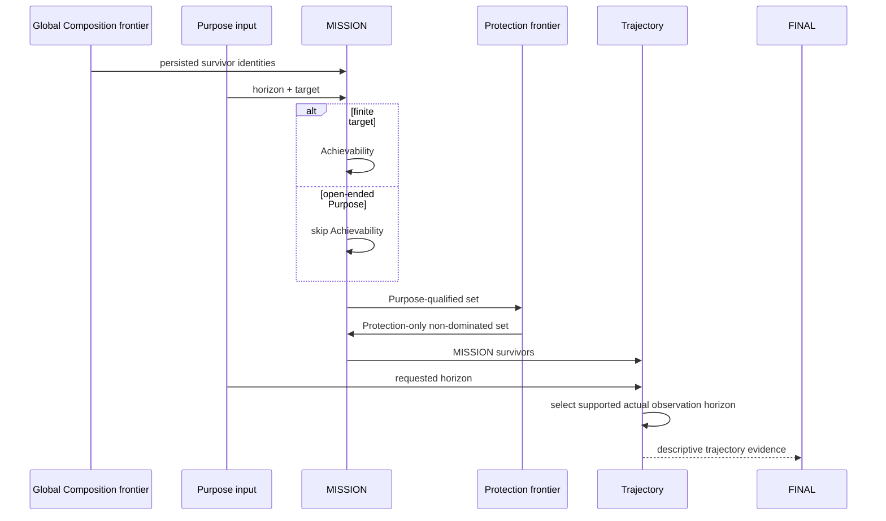

Supported analytical horizons are `3Y / 5Y / 7Y / 10Y`. The longest supported horizon not beyond the Purpose horizon is selected. Trajectory is descriptive and does not currently eliminate a MISSION survivor.

---

# 10. FINAL execution

FINAL receives only MISSION survivors and does not reopen MISSION eligibility.

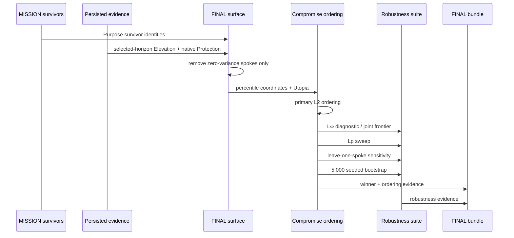

For selected horizon `H`, FINAL uses `7 Elevation(H) + 12 native Protection`. Retained spokes are equally weighted. L2 is the production ordering; robustness does not override the primary definition.

---

# 11. Family Architecture Validation execution

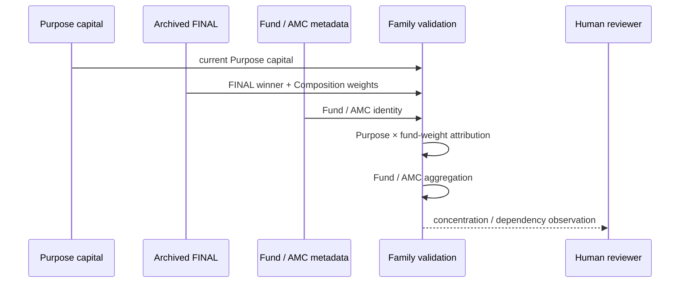

Core contract:

```text
Purpose current capital
        ×
FINAL Composition fund weight
        =
Attributed capital
```

Structured annual outputs:

```text
family_capital_attribution.csv
family_fund_concentration.csv
family_amc_concentration.csv
family_purpose_dependency.csv
family_attribution_manifest.json
```

This layer does not impose concentration limits, alter FINAL winners, create substitutes, optimize family allocation, or introduce transition-cost assumptions.

Integrity failures are fail-closed: malformed Purpose capital, duplicate/missing metadata, malformed/non-100% Composition weights, unknown Fund ISINs, manifest/hash mismatches, and attribution non-reconciliation stop the layer.

---

# 12. Purpose Staging execution

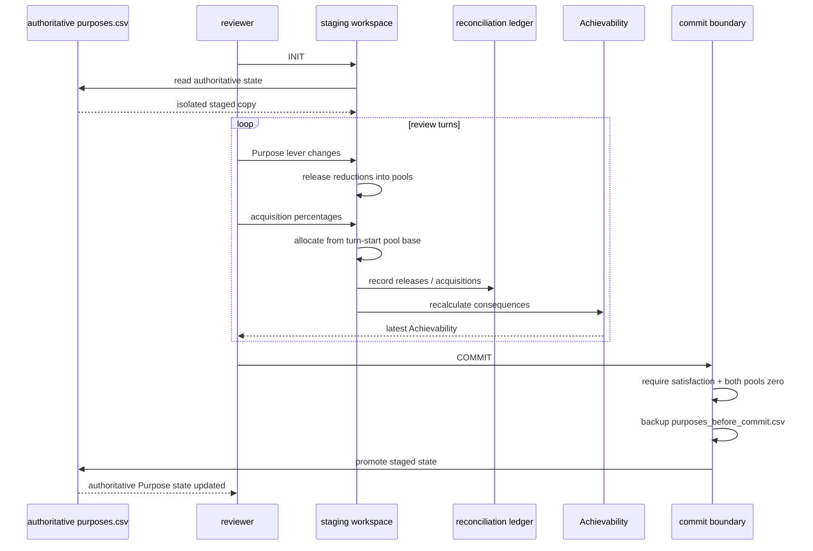

Reviewer-controlled levers are:

- `value`;
- `monthly_plan`;
- `desired`;
- `due` / `analytical_horizon_years`;
- `capital_acquire_pct`; and
- `sip_acquire_pct`.

Acquisition percentages use the same pool base at the start of the acquisition phase. Direct creation of capital or SIP is prohibited.

---

# 13. Historical Snapshot execution

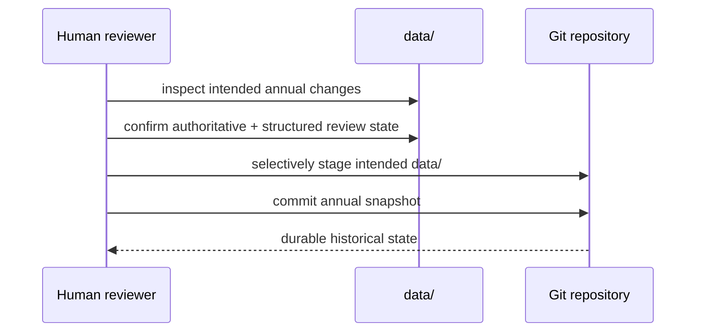

Historical Snapshot is a human-controlled Git persistence boundary. There is no separate automatic snapshotter. Runtime output and forensic logs remain disposable where configured.

---

# 14. LTS CURRENT → TARGET sequence

This stage begins after the annual snapshot boundary. It is not part of the LFS analytical optimizer.

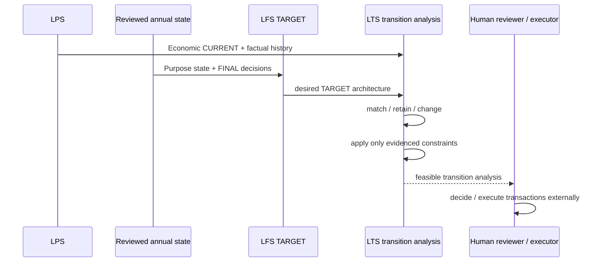

The states remain distinct:

```text
ANALYTICAL CURRENT = reviewed analytical architecture
ECONOMIC CURRENT   = actual source-derived holdings
TARGET             = reviewed formation implied by Purpose + FINAL
```

## Source archaeology first

The first LTS task is to inspect the actual portfolio/account material, especially the identified Geojit material, before defining a production CURRENT schema.

Establish what the source provides for:

- holding identity;
- units and current value;
- observation date;
- account/folio representation;
- acquisition/transaction information;
- cost information and granularity;
- source-authoritative versus presentation fields; and
- facts the source does not provide.

Do not infer holdings from Fund scope, FINAL summaries, or Purpose data. Do not manufacture acquisition dates, tax lots, cost basis, exit costs, account semantics, or transaction constraints.

## Intended reasoning

```text
HISTORICAL SNAPSHOT
        ↓
source archaeology
        ↓
minimum sufficient CURRENT contract
        ↓
source-derived Economic CURRENT
        ↓
TARGET from existing reviewed decisions
        ↓
CURRENT vs TARGET comparison
        ↓
source-derived constraints / feasibility
        ↓
human transition plan
```

Potential future constraints include ELSS lock-in, acquisition-date tax consequences, STCG/LTCG implications, exit loads, transaction costs, liquidity, minimum transaction constraints, SIP/STP/SWP sequencing, and retain/exit/stage/switch/redeem/invest alternatives — but only when source evidence earns them.

There is currently no production transition optimizer, tax engine, or transaction executor.

---

# 15. Persistence and resume semantics

The general persisted-evidence lifecycle is:

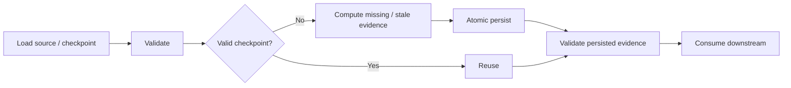

The invariant is:

> **A downstream failure must not invalidate upstream evidence that remains valid.**

Composition uses its narrow Completion Index to avoid unnecessary filesystem/JSON validation when indexed checkpoint metadata remains valid. This does not turn the index into a generic artifact store.

The multi-year LPS checkpoint principle is similarly conservative:

```text
previous validated LPS state
        +
new full-history CAS
        ↓
reconcile through prior boundary
        ↓
process new period
        ↓
new validated CURRENT
```

Historical amendments or discrepancies are rare Z-trigger conditions: stop, ask the human, repair the factual state, and resume. A failed run preserves the previous validated state.

---

# 16. Production audit trail

The annual analytical path is:

```text
LPS factual evidence
        ↓
LFS FUND
        ↓
TEAM
        ↓
COMPOSITION
        ↓
MISSION
        ↓
FINAL
        ↓
TARGET
        ↓
family attribution
        ↓
Purpose staging
        ↓
historical snapshot
        ↓
LTS CURRENT ↔ TARGET
```

The LPS factual path remains independently inspectable:

```text
source evidence
→ Transactions
→ Positions
→ valuation
→ Economic CURRENT
```

No analytical archive should be mistaken for an account statement.

---

# 17. What this execution document intentionally does not decide

This pipeline document does not introduce:

- Portfolio as a separate dimension;
- `CurrentState` as a Position wrapper;
- `CanonicalTransaction` as a second Transaction concept;
- generic Fund attributes without a downstream consumer;
- automatic Purpose trimming or hidden priority ranking;
- Composition regions or clustering;
- subjective Purpose-specific spoke weighting;
- arbitrary L-infinity thresholds;
- future-return forecasts; or
- automatic transaction execution.

The pipeline executes established contracts; it does not silently create new ones.
